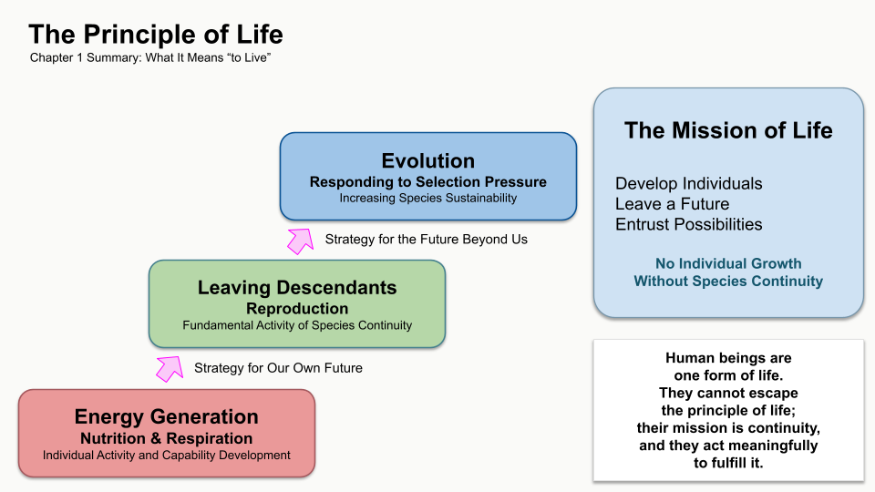
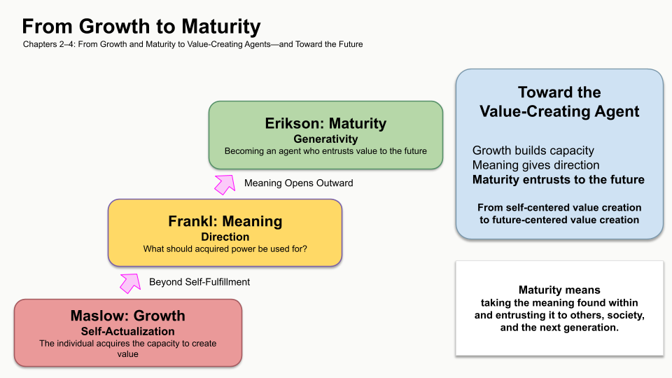
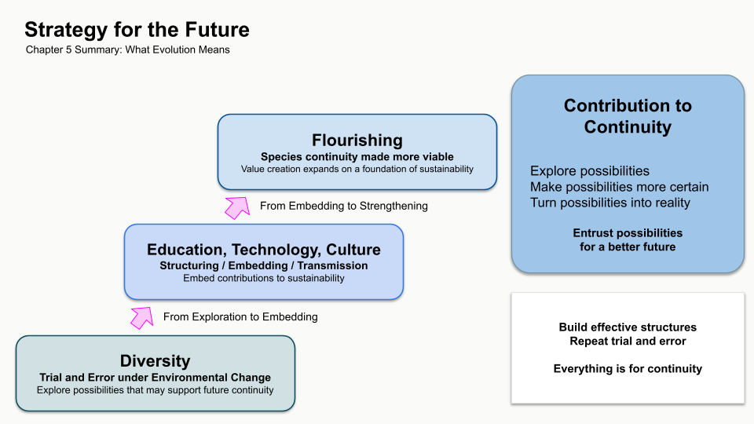
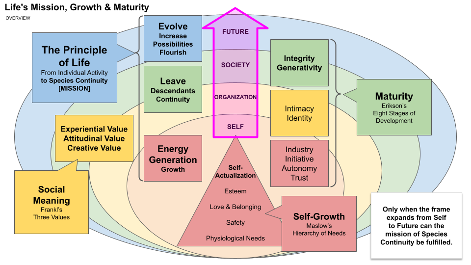

The Structure of Growth and Maturity — The Value-Creating Subject Sustaining Human Society —
=================================================

2026-8-28
NEC Solution Innovators, Ltd.
Innovation Laboratory
Technology Strategy Group
Open Source Strategy Professional
Shu Muto

© 2026 Shu Muto
Licensed under the Creative Commons Attribution 4.0 International License (CC BY 4.0).

**Note:** This English edition was translated by a generative AI (Claude Sonnet 5.0 / Anthropic and GPT-5.6 Sol / OpenAI). The original Japanese text is the authoritative version.

---

# Preface

In my university years (the 1990s), I learned in a biology class a definition of "what life is."

There are many theories about the definition of life, and settling on a single one is difficult. Having been told as much, I encountered the following way of thinking.

Life is a being that

* generates energy,
* leaves offspring, and
* evolves.

I believe this was the instructor's own synthesis, but by now I no longer know which theory, or whose words, it originated from.

Still, this definition alone has stayed with me for more than thirty years.

Rather than simply staying with me, I have kept thinking by means of it.

Why do people work?
Why do we seek growth?
Why do we raise children, pass on knowledge, and leave behind culture?
Or: why do organizations, societies, and civilizations rise and fall?
And what does it mean to "live"?

Whenever I have faced such questions, I have returned to life's three activities.

Generate energy.
Leave offspring.
Evolve.

I think that at least once a month, I have thought about people and society through this view of life. Work, family, education, organizations, technology, culture, institutions, society — the subject has changed, but the starting point has not.

Of course, thinking about this for thirty years has not biologically proven this definition.

What I have done is not an academic experiment. I have only repeatedly applied this way of thinking to my own experience, to the events around me, and to the history of human society.

Even so, when I think from this view of life, I have never once felt a decisive contradiction with reality.

And the longer I have kept thinking, the deeper my conviction has grown that the workings of life and the workings of human society stand on the same principle.

Just as life needs energy, human society needs the power to act.

Just as life leaves offspring, human society tries to hand value beyond itself.

Just as life has evolved amid a changing environment, human society too must keep changing in order to endure.

And yet, while human beings are a form of life, we do not leave these workings to instinct alone.

People choose what to leave behind.
People consider what to inherit and what to refuse.
People decide what kind of change they want.
And people can entrust something to a time that will never come to them.

In this book, I call that time "the future" (未来 — that which has not yet come).

The future is not a time that arrives simply because we wait.

> The future is something to be born, raised, and entrusted.

What we actually act on, learn, and experience is for the sake of a future we ourselves are likely to live to see. But the workings of life are not completed within one's own future alone. People raise children, leave knowledge, build institutions, and hand down culture for a next time they themselves cannot experience — just as our ancestors did before us.

The future, in a sense, will never come to oneself.
And yet, life keeps working toward it.

"To live," as this book uses the term, does not simply mean to exist.

It means to practice the principle of life.

> Generate energy,
> hand value on to what comes next,
> and keep changing in order to raise the possibility of sustaining that value.

In human beings, this appears as growing, finding meaning, maturing, and evolving.

This book does not aim to settle a strict definition of life. Nor does it try to explain every problem of human society with a single theory.

It sets down, as one line of reasoning, the view of life that I have held onto, without letting go, for more than thirty years.

For roughly four billion years, life has handed its workings on without a break. At the end of that chain, I now exist here.
Simply tracing this fact alone might be enough to arrive at the same view of life.
But what makes this view unshakeable for me is that I studied biology and encountered, firsthand, the almost miraculous precision of life's mechanisms.

If we could think not only of our own growth, but also of what to entrust to a time beyond ourselves —

and if we could change — not merely protect what we inherited, but change so as not to diminish the future's possibilities —

then people could take a deeper pride in "living."

That is what I believe.

---

# Contents

* Chapter 1: The Definition and Principle of Life
* Chapter 2: The Principle of Growth
* Chapter 3: The Principle of Meaning
* Chapter 4: The Principle of Maturity
* Chapter 5: The Principle of Evolution
* Chapter 6: The Value-Creating Subject and Structure
* Chapter 7: The Principle of Culture
* Chapter 8: The Thousand-Year Plan — Education and Sustainability —
* Chapter 9: The Question of Human Society's Sustainability

---

# Chapter 1: The Definition and Principle of Life

## 1.1 Why Start from Life

This book is about human society.

* What is growth?
* For what does a person work?
* Why do we pass on knowledge, cultivate culture, build organizations, and construct societies?
* And what does it mean to "live"?

This book considers these questions.
But it does not place its starting point in psychology, management studies, or philosophy.

> It places it in life.

The reason is simple.
> **Because human beings are life.**

The education, enterprises, nations, culture, and technology that humans practice all arise from the workings of human society as a form of life.
If that is so, then to understand them, it is not enough to look only at human beings.

> We must return to the underlying workings of life itself.

For roughly four billion years, life has been handed down without a break.
During that time the environment changed again and again; many species arose, and many went extinct.
Even so, life continued.

In this book, we call the workings life has practiced over these long ages **the principle of life**.

> The principle of life is the principle life has practiced in order to continue into the future.

Human society is no exception.

* Human beings, as life, grow,
* find meaning,
* mature,
* and keep changing.

This book reads this sequence of activities through the lens of the principle of life, and considers
**what it means to "live" within human society**.

---

## 1.2 What Is Life

What is life?

There are various answers to this question.

In this book, as a minimal definition for thinking about human society, we take life to be as follows.

Life is a being that

* generates energy,
* leaves offspring, and
* is capable of evolving.

Without generating energy, life's activity cannot be sustained.

Without leaving offspring, life ends there.

Without the capacity to evolve, life cannot adapt to environmental change, and extinction becomes a risk.

These three are the conditions that constitute life.

They naturally form a cycle,
which means this definition does not take the **individual** as its subject.
The subject of life is not the individual, but the **species**.

---

## 1.3 Seeing Life as a Species

Every individual eventually dies.

However excellent an individual may be, it cannot go on living forever.

Looking only at a single individual, neither "leaving offspring" nor "evolving" is possible.

Life has continued for roughly four billion years not because individuals lived long.

It is because life has been handed down across generations.

Therefore, when this book speaks of life, it means not the individual but the **species**.

Life is the ongoing work of continuing into the future as a species.

---

## 1.4 The Principle of Life

What follows from the definition of life, this book calls **the principle of life**.

In the principle of life, what matters most is not evolution.
Nor is it diversity, nor prosperity.

It is **enduring as a species**.

If a species does not endure,

* offspring,
* evolution,
* and prosperity

all lose their meaning.

Therefore, this book positions **sustainability** as the essential condition of life.

Life must first continue.

Only once it continues does becoming better take on meaning.

What matters here is that **evolution is not the goal**.

> Evolution is **the capacity to secure sustainability as a species**.

The environment surrounding life is always changing.
When the environment changes, survival strategies that had been effective may no longer work.
For that reason, life keeps changing.
Change itself is not the goal.

> **The capacity to change was acquired in order to secure sustainability as a species.**

However, evolution does not guarantee sustainability.
Life that cannot evolve loses its capacity to adapt to environmental change and raises its risk of extinction.

On the other hand, even a species that has evolved can go extinct due to environmental conditions or external factors.
And some forms of life, without evolving, manage to survive modestly in a closed environment.

That is precisely why, in this book, evolution is positioned not as sustainability itself, but as **a capacity for raising the possibility of sustainability**.

---

## 1.5 Diversity and Prosperity

Evolution does not proceed in a single direction.
Life attempts a variety of possibilities.

> **Diversity** is the wellspring of that.

Diversity is the possibility of evolution.

Because different individuals and different strategies exist, the possibility of adapting to environmental change expands.
But diversity itself is not the goal.

> Diversity is a property that raises a species' sustainability.

And when diversity functions sufficiently and sustainability is secured over a long span, life **prospers**.

Prosperity, as this book uses the term, does not mean a temporary success or an increase in population.
Nor does it call a state of merely surviving modestly "prosperity."

Prosperity refers to

> **a state in which value creation through diversity continues, founded on sustainability.**

> Sustainability is the precondition for prosperity,
> and prosperity is the ideal state built upon it.

---

## 1.6 Human Society as a Practice of Life

Human beings, too, are life.
Therefore, human society cannot escape the principle of life either.

However, human beings are not merely biological beings; we are beings who possess culture.

* We conduct education,
* pass on knowledge,
* build organizations,
* and form societies.

These do not contradict the principle of life.

Rather,

> they are the result of practicing the principle of life in the form of society.

In human society,

* individuals grow,
* eventually raise the next generation,
* and pass on culture.

This is the form in which human society realizes, in its own way,

* energy,
* offspring,
* and evolution

as they appear in life.

Here, I want to make clear what "to live" means in this book.

In this book, "to live" does not mean

* merely sustaining biological activity,
* nor an individual growing,
* nor self-actualization.

It means practicing the definition of life.
That is,

* generating energy,
* handing value on to the future,
* and continuing to change in order to raise sustainability.

Therefore,

> "The growth of the individual" is not, in itself, "to live."

It corresponds to the process of energy generation, the first stage of life.
Life does not complete itself within the individual.

The whole of the work of continuing into the future as a species is what this book calls "to live."

In contemporary society, "to live" is often used to mean an individual's happiness or self-actualization.
These are important activities for human beings.

However, this book does not equate them with the whole of life's workings.

An individual's growth matters.
But it is the starting point of life, not its terminus.

_**Figure 1: The Principle of Life**_

This book reconsiders human beings as value-creating subjects, and examines how their activity connects to the future.

The next chapter considers the first stage of that: "growth," that is, the generation of energy.

---

> **"Life does not complete itself within the individual."**
> **"Yet the principle of life begins with the individual's growth."**

---

# Chapter 2: The Principle of Growth

## 2.1 What Is Growth

In the definition of life, the first element to appear is **the generation of energy**.

Life must acquire the energy to sustain its own activity.
An individual's growth is the process of raising this capacity to generate energy.

* Building the body.
* Acquiring knowledge.
* Acquiring skill.
* Accumulating experience.

All of these are the workings by which life acquires the capacity to sustain and act upon itself.

The same is true in human society.

* Children receive education.
* Engineers learn technical skills.
* Companies accumulate profit and develop talent.
* Nations build industry and social infrastructure.

All of these are activities that raise the energy-generating capacity of the value-creating subject.

Therefore, this book positions **growth as the stage of "energy generation."**

---

## 2.2 The Growth Maslow Described

One of the most widely known theories explaining human growth is Maslow's hierarchy of needs.

Maslow organized human needs into stages:

* physiological needs,
* safety needs,
* belonging and love,
* esteem needs,
* self-actualization needs.

In later years, the concept of self-transcendence was added as well.

This theory has had a major influence in explaining what people seek and how they develop their capacities.

It continues to be cited widely today in education, talent development, and management studies.

---

## 2.3 Maslow Does Not Explain Life

However, this book rereads Maslow through the lens of the principle of life.

What Maslow explained is **the growth of the individual**.
Held against the definition of life, this corresponds to **energy generation**.

* Seeking safety.
* Developing one's capacities.
* Aiming for self-actualization.

All of these are

> workings by which an individual raises its capacity to create value.

But the definition of life does not end with energy generation.

Life only becomes life once it

* leaves offspring
* and is capable of evolving.

In other words,

> Maslow explained a part of life,

not life itself.

---

## 2.4 A Society That Stops at Growth

Let us look at contemporary society here.

* "Living as your true self."
* "Enjoying your life."
* "Self-actualization."

Such phrases are spoken of endlessly.
I do not intend to deny them.

But this book does not regard them as **the whole picture of life**.

All of these speak only of

> the growth of the individual,

that is, merely the stage of energy generation.

Life does not complete itself within the individual.

> It is a workings that hands value on to the future,
> while further raising sustainability amid a changing environment.

If society as a whole makes growth alone its aim, the principle of life stops midway.

If we pursue only the fulfillment of the individual and the handing-on to the next generation weakens,
> the birthrate falls, knowledge is lost,
> and organizations lose the ability to develop successors.

This is not merely a population problem.
Seen through the principle of life, it is **a state in which energy generation alone has swollen out of proportion.**

---

## 2.5 Growth Is Preparation for the Future

So what is growth for?
This book does not treat growth as an end in itself.

Growth is

> preparation for handing value on to the future.

* We learn knowledge partly in order to leave it behind.
* We hone technical skill partly in order to produce future value.
* We develop organizations partly in order to hand them on to the next generation.

Energy generation is the foundation for moving toward the future.

---

## 2.6 The Limits of Growth

Growth is indispensable to life.

* Training the body.
* Learning knowledge.
* Acquiring skill.
* Developing social capacities.

All of these are the process by which life acquires the capacity to create value.

But growth itself is not the goal.

However much capacity is raised,

> if that capacity does not turn toward the future, the principle of life is not completed.

Growth is

> the acquisition of the power to create value,

and it does not answer the question of what that power is for.
It is only here that

> a person begins to seek "meaning."

---

> **"Growth gives the power to create value."**
> **"Meaning gives that power a direction."**

---

# Chapter 3: The Principle of Meaning

## 3.1 Growth Alone Does Not Satisfy

One's capacities are sufficiently developed.
Life is no longer a struggle.
One is recognized socially.
And yet, people go on asking.

> "What is this power for?"

The further growth advances, the more unavoidable this question becomes.
Growth gives capacity. But capacity alone does not decide its direction.

---

## 3.2 The Meaning Viktor Frankl Described

Viktor Frankl stated that human beings are beings who seek meaning.

* Life contains suffering.
* It contains failure.
* It contains loss.

And yet, **those who have found meaning for themselves can overcome hardship**.

Frankl positioned "meaning" as **the source of human spiritual strength**.

This way of thinking has influenced a great many people up to the present day.

---

## 3.3 Meaning Is Not a Mission

This book does not deny Frankl's theory.

But seen through the lens of the principle of life,

> meaning is not the terminus.

"To live," as this book uses the term,

> means to practice the definition of life.

Life

* generates energy,
* leaves offspring,
* and evolves.

This is **the mission of life**.

Therefore,

> "There is no meaning to living."

This does not mean that living is meaningless.
Because, as a form of life, "to live" is already the supreme mission given to us.

Meaning is what determines

> the form in which that mission is to be practiced.

* Some find meaning in leaving knowledge behind.
* Some find meaning in saving human lives.
* Some find meaning in producing new knowledge.
* Some find meaning in building a better society.

Meaning differs from person to person.

But

> the mission that lies beyond it is, in every case, "to live" —

that is, "to practice the principle of life."

---

## 3.4 Meaning Is the Sprout of Awareness of One's Mission

A person

> is not aware of life's mission from the outset.

First,

* one comes to know what one can do,
* one acquires capacities,
* one gains a role within society.

And then,

> "What is this power for?"

one begins to ask.

This very question is

> the sprout of beginning to become aware of life's mission.

Meaning is

> not the mission itself.

But

> by finding meaning,
> a person begins to turn their gaze outside themselves —

toward the future.
Toward the next generation.
Toward society.

From here,

> maturity begins.

---

## 3.5 Meaning Turns Toward the Future

To hold meaning is not mere satisfaction.

Meaning **becomes a force that turns toward the future**.

* Wanting to leave knowledge behind.
* Wanting to pass on a skill.
* Wanting to raise a successor.
* Wanting to make society better.

Each takes a different form.

But what they share in common is

> that they direct value outside oneself.

Meaning is

> orientation and motivation **toward the future**.

---

## 3.6 From Meaning to Maturity

In the principle of life,

> meaning is not the terminus.

Meaning is

> the first step of becoming aware of one's mission
> and beginning to walk toward the future.

When that walk becomes

* the raising of the next generation,
* the transmission of knowledge,
* the formation of culture,

> a person matures.

The next chapter considers

> this activity of "handing value on to the future"

from the perspective of maturity.

---

> **"Meaning is the sprout of awareness of one's mission."**
> **"The value-creating subject is the one who practices that mission."**

---

# Chapter 4: The Principle of Maturity

## 4.1 What Is Maturity

Finding meaning alone does not put the principle of life into practice.

Meaning gives direction.

> But unless one walks in that direction, the future does not change.

This book calls that walk **maturity**.

> Maturity is transforming into a subject that hands value on to the future.

It is not merely accumulating years.
Nor is it simply having more knowledge or experience.

> It is coming to use the capacities one has acquired not only for oneself, but for the future.

---

## 4.2 The Maturity Erikson Described

Erik Erikson organized human development into eight stages.

Among them, the important task he presented for adulthood is **generativity**.
Generativity refers to the activity of nurturing the next generation, contributing to society, and sustaining the future.

It is not only about raising children.

* Developing successors.
* Passing on knowledge.
* Nurturing organizations.
* Contributing to society.

All of these are expressions of generativity.

Erikson regarded a human being's expansion of concern beyond the self as an important feature of maturity.

---

## 4.3 What Are Offspring

Life leaves offspring.
In biology, this means the transmission of genes.

But in human society, it does not stop there.

* Education transmits knowledge.
* Culture transmits values.
* Technology transmits skill.
* Organizations transmit experience.
* Institutions transmit social order.

In other words, human beings are able to hand **value itself** on to the future.

In this book, this **broader sense of inheritance is also treated as a practice of the principle of life's "leaving offspring."**

---

## 4.4 A Person Becomes a Value-Creating Subject

In this book, a subject that creates value and hands that value on to the future is called a "value-creating subject."

* Growth raises one's own capacity.
* Meaning gives that capacity a direction.
* Maturity hands that capacity on to the future.

Only here does a person become a **value-creating subject**.

Creating value alone is not enough.

> If that value is lost together with one's own life, the principle of life is cut short.

A matured subject connects value to the future.

That is precisely why

* education exists,
* development exists,
* collaboration exists,
* and inheritance exists.

> A value-creating subject is one who creates value on their own, and hands that value on to the future.

---

## 4.5 Maturity Transcends the Individual

Maturity is not sacrificing oneself.
Nor is it denying self-actualization.

Rather, it is precisely because one has grown sufficiently that one can nurture others and return value to society.

Maturity is

> a shift from self-centered value creation
> to future-centered value creation.

It might be

* a parent raising a child,
* a teacher raising a student,
* an executive raising the next generation of executives,
* a politician thinking not of a few years ahead but of the society decades hence.

The forms differ, but the essence is the same.

> Handing value on to the future.

That is maturity.

_**Figure 2: From Growth to Maturity**_

---

## 4.6 Maturity Alone Does Not Sustain

However, maturity too has its limits.

However much value is handed down,

> when the environment changes,
> yesterday's value does not necessarily hold today.

* Knowledge is updated.
* Technology advances.
* Society changes.

> Inheritance alone will eventually leave value stranded by the times.

Life has survived some four billion years not merely by handing on value, but by continuing to change.
Human society is no exception.

The next chapter considers this principle of life: "continuing to change."

---

> **"Maturity hands value on to the future."**
> **"Evolution keeps adapting that value to the future."**

---

# Chapter 5: The Principle of Evolution

## 5.1 Inheritance Alone Does Not Sustain

A matured value-creating subject hands value on to the future.
That was the workings of life's principle of "leaving offspring."

But that alone is not enough.

* Society changes.
* Technology advances.
* Values change.
* The environment, too, keeps changing.

What held value yesterday will not necessarily hold value tomorrow.

If we repeat inheritance alone,

> society will eventually be left behind by change.

Life

> acquired the capacity to change
> at the same time as it inherited.

That is precisely why

> it has been able to continue into the future as a species.

---

## 5.2 What Is Evolution

In this book,

evolution is defined as

> **the capacity to keep changing in order to raise sustainability.**

What matters here is

> that there is no value in change for its own sake.

* Chasing trends.
* Jumping at new technology.
* Denying the past.

None of these is evolution.

Evolution is

* the workings of **judging**
* what to change and what not to change,
* in order to continue into the future.

The goal is not change.

The goal is, in every case,

> **enduring as life.**

---

## 5.3 The Evolution of Human Society

Human beings have not adapted toward the future by genes alone.

* Accumulating knowledge.
* Improving institutions.
* Developing technology.
* Cultivating culture.

And,

> sharing these, pooling wisdom, and honing one another.

This is precisely

> the mechanism of evolution that human society has acquired.

In human society,

> changes that no single lifetime could ever achieve
> can be accumulated across generations.

This is precisely

> the greatest strength human society possesses.

---

## 5.4 Evolving Amid Uncertainty

We cannot fully predict the future.
Yet that does not mean we can stand still.

This attitude connects to the concept of **negative capability**.

Not knowing the future does not mean closing off uncertainty with easy answers.
Holding contradiction and ambiguity as they are, one still observes, tries, and keeps thinking.

> **Maturity is not having an answer quickly.**
> **It is also being able to keep judging even amid uncertainty, without rushing to an answer.**

Since the future cannot be fully predicted, what evolution requires is not "knowing the correct answer,"
but **the capacity to endure a state in which no correct answer yet exists, while still preserving possibility.**

Life, over roughly **four billion years**,

> has repeated change to prepare for the future.

That journey was a continuous trial and error.

Human society is the same.

* Accepting the unknown.
* Preserving diverse possibilities.
* Learning from failure.

And then,

> changing itself in preparation for the future.

Evolution is

> not the capacity to predict the future.
> It is the capacity to keep preparing for the future.

---

## 5.5 Diversity Is the Possibility of the Future

This book has positioned diversity as **the possibility of evolution**.

Diversity does not exist for the present alone.
We do not know what environment the future will bring.

That is precisely why it matters that

* various ways of thinking,
* various experiences,
* various technologies,
* various values

exist.

Diversity is

> the possibility of producing the future.

---

## 5.6 The Value-Creating Subject Keeps Evolving

A value-creating subject creates value.
It hands value on to the future.

And then,

* it questions the inherited value again,
* refines it,
* and creates new value.

As long as this cycle continues,

> society can keep raising its sustainability.

* Growing.
* Finding meaning.
* Maturing.

And,

> continuing to change **in ways that contribute to endurance.**

This is

> what this book calls "to live."

_**Figure 3: Strategy for the Future**_

_**Figure 4: 生命の使命と成長・成熟**_

---

> Life, over roughly four billion years, has raised the sustainability of its species by growing, handing on value, and continuing to change.
> Human society, too, stands upon this principle of life.
> Enterprises, education, politics, science, and technology cannot escape this principle.

In the latter half of this book, building on this principle of life, we consider how the value-creating subject expands into organizations, society, and, ultimately, civilization.

---

> **"The maturity of one person alone does not sustain society."**
> **"When value-creating subjects connect with one another and combine with structure, a sustainability beyond the individual is born."**

---

# Chapter 6: The Value-Creating Subject and Structure

## 6.1 One Person's Maturity Alone Does Not Sustain

Up to this point, we have looked at human beings as individual value-creating subjects.

* A person grows.
* Finds meaning.
* Matures.

And then,

> keeps making changes that contribute to endurance, while entrusting inherited value to the future.

But however maturely a single human being lives, that person will one day be gone.

* The finest engineer,
* the finest teacher,
* the finest executive,
* the finest politician —

none exists forever.

Nor is that all.
There are limits even to a single person's act of handing their own value on to the future.

* Transmitting knowledge requires someone to receive it.
* Producing new value requires connection with people who hold different knowledge and experience.
* Raising the next generation cannot be achieved by the educator alone.
* Continuing value creation after one is gone requires an environment that supports it.

In other words,

> sustainability is not born from one person's maturity alone.

Just as the principle of life is not completed within the individual, the workings of human society are not completed by a single value-creating subject alone.

What is required of a matured subject is **not to accomplish everything by oneself**.

Rather, it is

> **to understand that one cannot build the future alone, and to connect oneself to other subjects and to structure.**

---

## 6.2 Value-Creating Subjects Connect with One Another

In human society, value-creating subjects do not exist in isolation.

* People learn from others.
* People teach others.
* People collaborate with those who hold different experience.
* At times they conflict,
* they argue,
* and, while confronting things they cannot understand,
* they change their own thinking.

There, value is not simply handed on in a single direction.

> It travels back and forth among multiple subjects, and through that interaction, transforms into new value.

For example, if a single engineer merely holds knowledge, that knowledge is only an individual's capacity.

* If it is passed to another engineer, the knowledge is shared.
* If people with different knowledge collaborate, a technology that did not previously exist may be born.
* And if someone who learned that technology thinks of a new use for it elsewhere, the value changes yet again.

This is not mere information transfer.

> **The interaction among value-creating subjects itself is what produces value.**

That is precisely why diversity has meaning.

* Different subjects exist.
* They hold different knowledge.
* They hold different experience.
* They make different judgments.

When these are connected, the possibilities of the future expand.

But if this workings depends only on subjects happening to meet by chance, it will not be stable.

What becomes necessary there is

> **structure.**

---

## 6.3 What Is Structure

The word "structure" may bring to mind an organizational chart or an institution.

But the structure this book refers to is not only that.

* Merely drawing an organizational chart does not make people collaborate.
* Merely writing rules does not produce value.
* Merely defining a process does not hand value on to the future.

In this book, structure is understood as

> **the mechanism that supports the connection and interaction among value-creating subjects, and makes value creation sustainable.**

This includes

* venues that connect people with people,
* roles and responsibilities,
* mechanisms of decision-making,
* mechanisms for sharing knowledge,
* mechanisms of learning and education,
* pathways that connect to the outside,
* pathways by which new subjects can join,
* and mechanisms for handing value on to what comes next.

Institutions, organizations, processes, and documents are the means to this end.

The purpose of structure is not to maintain these means themselves.

> **It lies in sustaining the interaction among subjects.**

---

## 6.4 Subject and Structure Make Each Other

Then who builds structure?

> Of course, people build it.

But,

> **a single matured subject does not complete structure alone.**

This is an important point.

A value-creating subject

* acts upon others,
* shares knowledge,
* proposes necessary mechanisms,
* connects other subjects,
* acts upon existing institutions,
* and, at times, creates new institutions.

But there is no need to carry all of this alone.

> Structure, to begin with, is what supports the interaction of multiple subjects.

If that structure is built dependent only on a single subject, the very act of building structure becomes dependent on that individual.

What is needed is

> **that structure forms out of the interaction that arises as a subject connects with other subjects.**

And once formed, structure in turn supports the subject.

* Because a place to learn exists, new people can join.
* Because knowledge is shared, past experience can be carried forward.
* Because roles are divided, no one has to bear everything alone.
* Because mechanisms for decision-making exist, no single person always has to judge.
* Because pathways connecting to others exist, new value can be brought in.

In other words,

> **subjects form structure, and structure supports and nurtures subjects.**

And further, subjects who have grown up within it question the existing structure again.

* When the environment changes, structure changes too.
* When new subjects join, new relationships are born.

In this way, subject and structure keep changing each other.

---

## 6.5 Do Not Burden a Hero with Sustainability

At times, one outstanding individual produces great value.

* Understanding more deeply than anyone else,
* acting more than anyone else,
* connecting people,
* solving problems,
* creating value.

Such a presence becomes a great force.

But if that one person must

* create value,
* nurture others,
* leave knowledge,
* connect people,
* arrange institutions,
* secure resources,
* mediate conflict,
* and even raise their own successor,

then this **cannot be called a sustainable structure**.

In the world of open source, this problem appears clearly.

There are excellent maintainers.

* They write code.
* They review.
* They handle issues.
* They release.
* They support new contributors.
* They run the community.
* They coordinate relationships with companies.
* At times they even raise funding.

If all of this concentrates on one person, or a small handful of people, **they will eventually burn out**.

And when that person can no longer continue their activity, if they are further held responsible with

* "You did not raise a successor,"
* "You did not build a sustainable mechanism,"

that is putting the cart before the horse.

> **If even the responsibility for creating sustainability is concentrated on the hero, sustainability itself becomes dependent on the hero.**

To hand value on to the future requires

* subjects to receive it,
* people to connect subjects to one another,
* people to support education,
* people to provide resources,
* people to translate the activity to society,
* and, in turn, a structure that makes all of this possible.

The maturity of one person does not mean

> becoming able to carry everything.

It also means

> **understanding one's own finitude, and becoming able to entrust value to the future together with others.**

---

## 6.6 Structure Alone Does Not Sustain, Either

On the other hand, building structure alone does not solve the problem either.

Seeking sustainability, people try to leave structure behind.

* Building institutions.
* Making rules.
* Building organizations.
* Leaving documents.

These are important.

But,

> **structure remaining and it remaining as value are not the same thing.**

* The institution remains.
* The organization remains.
* The rules are still observed.

And yet,

* no one can explain why that institution exists,
* no one knows what the rule is meant to protect,
* and repeating past judgments becomes the goal in itself.

If it comes to that, structure remains, but

> the **reasoning** that produced it has been lost.

And when the environment changes, structure that once contributed to sustainability can instead obstruct change.

As stated in Chapter 5,

> **evolution is continuing to change in ways that contribute to endurance, while judging what to change and what not to change.**

Structure is no exception.

* Structure does not exist merely to be protected.
* It must be changed when necessary.

The one who makes that judgment is not

* the institution,
* nor the rule,
* nor the document.

**It is the value-creating subject — that is, the human being.**

That is precisely why

> **structure without a subject does not move, and a subject without structure does not endure.**

The two are mutually necessary.

---

## 6.7 From Individual Capacity to Autonomous Sustainability

Here we connect to Part One, *The Structure of Open Innovation.*

In Part One, we examined the structure by which value gained from external connection is converted within an organization, and further circulates into contribution and value creation.

There, we addressed the transition:

* from activity by a handful of enthusiastic individuals,
* to participation by multiple people,
* to an organization converting value,
* to a state in which activity eventually circulates autonomously.

Reread in this book's terms, what that requires is not merely an institution.

* A matured value-creating subject exists.
* That subject connects with other subjects.
* Different subjects exchange value with one another.
* A structure forms that supports that interaction.
* Through structure, new subjects join and grow.
* New subjects question the structure again, and change it when necessary.
* And that cycle continues without depending on any one particular person.

This is

> **autonomous sustainability.**

Autonomy does not mean not needing outside help.

Rather, the opposite.

* Connecting with others,
* connecting with the outside,
* receiving value,
* returning value,
* multiple subjects each making their own judgments,
* and being able to keep the cycle going without depending on any one particular person.

That is autonomy.

Therefore,

> **when multiple value-creating subjects connect with one another and interact with a structure that supports that workings, a sustainability beyond the individual is born.**

This is also the point where the organizational structure treated in Part One and the principle of life treated up to here intersect.

---

## 6.8 From Structure to Culture

However, one problem remains.

Even if structure exists, if the people within it do not understand

* why that structure is necessary,
* what it is trying to entrust to the future,
* what may be changed,
* and what must be protected,

then structure will eventually become an empty shell.

* Documents alone are not enough.
* Institutions alone are not enough.
* Organizations alone are not enough.
* And even one person's understanding alone is not enough.

What is needed is

> **that subjects who understand the reasoning exist throughout society, and that these subjects are connected to one another.**

* One person understands.
* That person practices it.
* Another person encounters that practice.
* They discuss it.
* At times, different interpretations arise.
* Even so, while sharing the question of what to entrust to the future, each judges from their own position.
* And it is handed on to the next subject.

Once we reach this point,

> the reasoning is no longer the possession of any one person.

Nor is it something recorded only in an institution.

> It becomes something that exists within the judgment and action of many subjects.

When that is handed down across generations,

> structure changes into something deeper still.

The next chapter considers this workings from the perspective of **culture**.

---

> **"The maturity of one person alone does not produce sustainability."**
> **"When subject interacts with subject, and structure, and even the reasoning behind it is handed on to the future, a sustainability beyond the individual is born."**

---

# Chapter 7: The Principle of Culture

## 7.1 What Lies Beyond Structure

The previous chapter considered the relationship between the value-creating subject and structure.

One person's maturity alone does not sustain.

* Value-creating subjects connect with one another,
* a structure is born that supports their interaction,
* structure nurtures new subjects,
* and those subjects, in turn, change the structure.

Through this cycle,

> **a sustainability beyond the individual is born.**

But even this is not enough.

* The organization remains.
* The institution remains.
* The rules remain.
* The mechanisms of education exist.

And yet,

* no one knows why it is done,
* nor what it is trying to entrust to the future.

Only,

> "because it has always been done this way" —

for that reason alone, the activity repeats.

Structure remains there, but

> **the reasoning does not remain.**

Leaving structure to the future alone does not sustain human society.

What must be handed on to the future is

> the **reasoning** itself that produced the structure.

A state in which that reasoning is understood, practiced, and further handed on to the next subject by many subjects —

> in this book, we call that **culture**.

---

## 7.2 What Is Culture

The word "culture" is broad.

* Art is culture.
* Language is culture.
* Ways of life are culture.
* Companies have corporate culture,
* regions have regional culture,
* and nations, too, have culture.

But this book takes a somewhat narrower view of culture.

> **Culture is a state in which reasoning is understood, practiced, and inherited across generations.**

What matters here is

that culture is **not a thing in itself**.

* It is not merely knowledge written in a book.
* It is not an institution.
* It is not a building.
* It is not a rule.

These can record and support culture.

But they alone do not become culture.

For example, even if a book recording an outstanding idea remains,

* if no one reads it,
* if no one understands it,
* and if no one practices it,

that idea does not function within society.

Conversely,

* even without codified rules,
* if people understand that reasoning,
* judge by it,
* act on it,
* and hand it on to the next person,

then culture exists there.

> Culture is a state in which **reasoning keeps working within people**.

---

## 7.3 Culture Cannot Be Preserved

Human beings try to leave value for the future.

To that end, we

* record,
* write books,
* leave film,
* store data,
* build institutions,
* leave buildings.

These are important.

But,

> **preservation and inheritance are not the same thing.**

Information can be preserved.
Knowledge, too, can be preserved to some degree.

But reasoning cannot be preserved,
because reasoning is not mere information —

> **it works only once a subject who has understood it judges and practices it within reality.**

* Leaving a recipe behind and raising a cook are different things.
* Leaving a textbook behind and passing on a discipline are different things.
* Preserving source code and leaving behind a community that can keep developing that software are different things.

A record preserves a past state.

Culture

> **exists through a present subject understanding and practicing again what has been inherited.**

That is why culture is not something to be preserved.

> **It can exist only by continuing to be practiced.**

---

## 7.4 Culture Exists Between People

Then how is reasoning inherited?

* Is it enough to read a book?
* Is it enough to take a class?
* Is it enough to read a manual?

Of course, these matter too.

But,

> not everything a human being hands on can be put into words.

* A skilled engineer knows where to look.
* A teacher changes how they explain, even with the same explanation, depending on the student.
* A doctor looks not only at test values but at the patient's condition.
* A craftsman senses differences that numbers cannot fully express.

Much of this is

* experienced,
* observed,
* failed at,
* and acquired through working with others.

There, it is not only information but

> **the very way of judging**

that is being handed on.

That is precisely why human beings

* gather,
* teach,
* learn,
* discuss,
* build together,
* fail,
* at times clash,
* and, through it all, encounter one another's judgment.

Culture does not exist within one person alone.

> **Culture exists within the interaction between people.**

---

## 7.5 Culture Cannot Be Summarized

Contemporary society demands that vast amounts of information be handled efficiently.

* Long texts get summarized.
* Experience gets turned into procedures.
* Knowledge gets stored in databases.
* Judgment gets converted into rules.
* And artificial intelligence has become able to generate needed answers from vast information in a short time.

This is an extremely powerful capacity that human society has acquired.

But there is one danger here.

> **Compressing information and compressing culture are not the same thing.**

* If only the result is extracted, the process that led to it is lost.
* If only the successful judgment is kept, the reason another possibility was discarded is lost.
* If only the rule is kept, the reason the rule became necessary is lost.
* If only the conclusion is kept, the capacity to question that conclusion is lost.

And when the environment changes,

> those who hold only past answers cannot produce new ones.

What culture hands on is not answers alone.

> **It is the reasoning for producing answers.**

So we cannot simply encapsulate information and intelligence and think,

> "It is enough just to leave this."

Culture requires

* people engaging with people,
* questioning,
* trying,
* failing,
* thinking,
* at times conflicting,
* and, even so, thinking again —

a process that, on the surface, looks inefficient.

It is only within this messy interaction that reasoning first takes root within the next subject.

> **Culture cannot be summarized.**

One can learn culture using summarized information.
But,

> the summary itself is not culture.

---

## 7.6 A Closed Culture Withers

When people try to protect culture, they often try to keep it from changing.

* Protecting tradition.
* Protecting form.
* Protecting the teachings of the past.

These have their meaning.

But we must recall the principle of life seen in Chapter 5.

> **To sustain, the capacity to change is necessary.**

Culture is no exception.
If culture is fixed completely, it is left behind by a changing environment.

That is why culture must

* connect with the outside,
* encounter different cultures,
* encounter different values,
* encounter different knowledge.

There, naturally,
* friction arises.
* one's own common sense no longer applies.
* one encounters ways of thinking one cannot understand.
* at times, one must reexamine what one had thought was correct.

But it is precisely this interaction that gives culture new possibility.

> **A closed culture can be inherited, but it is difficult for it to evolve.**

Connection with the outside does not exist to destroy culture.

> **It exists to keep asking what to protect and what to change.**

Here again,

> diversity becomes the possibility of the future.

---

## 7.7 Culture Exists as an Ecosystem

Taken this far, it becomes difficult to treat culture as the possession of a single organization.

* Knowledge moves across organizations.
* People move too.
* Technology moves too.
* Values influence one another.
* People who learned at educational institutions go into companies.
* People who gained experience at a company move to another organization.
* Research outcomes are used by industry.
* Problems arising in industry return to research.
* The wisdom of local communities influences institutions.
* The cultures of different nations influence one another.

There, value does not circulate only within a single organization.

> **Society itself becomes a vast connective system of value-creating subjects.**

We can grasp this as an **ecosystem**.

Within an ecosystem,

* there is no single ruler.
* different subjects exist,
* they influence one another,
* at times compete,
* at times cooperate,
* and each activity supports the activity of another subject.

This closely resembles a biological ecosystem.

It is not that a single subject bears everything.

> **It is by different subjects connecting with one another that sustainability as a whole is raised.**

The culture of human society, too, is cultivated within such interaction.

---

## 7.8 Culture as the Inheritance of Reasoning

We have traced this from Chapter 1 to here.

Life generates energy.

> In human beings, this appears as **growth**.

A person who has grown

> finds **meaning** — for what purpose to use that capacity.

When that meaning turns outward, beyond the self,

> a person becomes a **matured value-creating subject** who entrusts value to the future.

But one person alone cannot hand value on to the future.

> There, the subject connects with other subjects,
> and builds a **structure** that supports that interaction.

And then,

* subjects who understand the reasoning within the structure grow,
* practice it together,
* question it again,
* and hand it on to new subjects.

This state

> is what this book calls **culture**.

Therefore,

> **culture is not preserving the past.**
> **It is continuing to generate, into the future, subjects who understand the reasoning.**

For culture to sustain does not mean

> that the same answer is repeated forever.

It means that the next subject

* on the basis of the inherited reasoning,
* thinks for themselves,
* judges for themselves,
* changes the past answer when necessary,
* and can further entrust it to what comes next.

That, precisely, is the sustaining of culture.

And there is one of the most important mechanisms human society has acquired in order to carry out this workings intentionally.

**Education.**

Culture does not remain naturally.
To entrust it to the future, we must raise the next value-creating subject.

The next chapter takes up this workings from an even longer span of time.

---

> **"Culture is a state in which reasoning is handed on, person to person, without end."**
> **"Education is the workings of continually generating, into the future, the value-creating subjects who carry that reasoning."**

---

# Chapter 8: The Thousand-Year Plan — Education and Sustainability —

## 8.1 Building a Future That Will Not Come to Oneself

Up to here, we have considered the workings by which human society continues into the future.

A person

* grows,
* finds meaning,
* matures,
* and entrusts value to the future.

But one person alone does not sustain.

So,

* one connects with other subjects,
* builds structure,
* interacts,
* and inherits reasoning as culture.

Then,

> **how far into the future should we think?**

* A year ahead?
* Ten years ahead?
* A hundred years ahead?

We ordinarily
> think of the future within the span of our own lives.

* An individual thinks of life a few years ahead.
* A company thinks of next year's business plan.
* A politician thinks of the next election.
* A nation sometimes thinks of population and economy decades ahead.

But the time of life is far longer than that.
Over roughly four billion years,

> **life has kept handing itself on into a future in which it itself will not exist.**

We too stand within that chain.

If so, thinking about sustainability means

> not only thinking about one's own future.
> **It means thinking about a future that will never come to oneself.**

---

## 8.2 The One-Year Plan, the Ten-Year Plan, the Hundred-Year Plan

In the Chinese classic *Guanzi*, there is a passage later known as "the plan for one year, the plan for ten years, the plan for a lifetime."

There it is said, in essence, that

* if you are looking one year ahead, plant grain;
* if you are looking ten years ahead, plant trees;
* if you are looking further ahead than that, raise people.

This way of thinking overlaps closely with the principle of life discussed throughout this book.

If you raise grain, you can obtain a harvest in a relatively short time.
If you raise a tree, its benefit continues for much longer.
But,

> **if you raise a person, that person can go on to create further value and raise yet another person.**

There is a decisive difference here.

It is not only the value produced by grain or trees.
A person who has been raised

> **becomes a subject who creates value on their own.**

And then,

* they learn,
* they think,
* they judge,
* they produce new value,
* they convey it to others,
* and they raise the next subject.

In other words, education is

not merely the act of handing over knowledge.

> **It is the workings of producing, into the future, the value-creating subject itself.**

---

## 8.3 What Does Education Inherit

When we think of education,

it is easy to think of teaching knowledge and skill.

* Teaching reading and writing.
* Teaching mathematics.
* Teaching science.
* Teaching technical skill.
* Teaching history.

Of course, these matter.

But as we saw in Chapter 7,

> **handing over information and inheriting culture are not the same thing.**

* One can teach an answer.
* One can teach a procedure.
* One can teach past successes.

But we cannot know the answers to the problems of the future,

because

> **we cannot fully predict the future environment.**

So what education must hand on to the future is not the past answer alone.

* Why that answer was reached.
* What was valued in making that judgment.
* What was doubted.
* What was changed, and what was protected.
* How one faced what could not be known.

In other words,

> **the reasoning for producing an answer.**

Education is

> not the workings of preserving past answers for the future.
> **It is the workings of enabling future subjects to produce their own answers.**

---

## 8.4 Education Is Raising Value-Creating Subjects

Here we return to the argument of Chapters 2 through 5.

A person

* first grows.
* acquires knowledge.
* acquires skill.
* accumulates experience.

But

> **acquiring capacity alone does not complete the principle of life.**

For what will that capacity be used?

* A person finds meaning.

And,

* when that meaning turns outward, beyond the self,
* and comes to entrust value to the future,
* one becomes a matured value-creating subject.

Education, too, therefore, cannot end simply with the acquisition of capacity.

> **The purpose of education is not to produce an outstanding individual.**

More precisely, it is not only that.

Education is

> **the workings of raising a subject who learns on their own, thinks on their own, creates value on their own, and can entrust that value to the future.**

So education requires, beyond knowledge,

* engaging with others,
* encountering different ways of thinking,
* trying,
* failing,
* questioning,
* judging,
* taking responsibility for one's own judgment,
* and returning what one has gained to what comes next.

Education is

> **raising a subject capable of practicing the principle of life.**

---

## 8.5 The Hundred-Year Plan Lies in Education

In Japan, the expression

> "the nation's hundred-year plan lies in education"

is often used.

Its meaning becomes clear when thought through the principle of life.

* Building roads matters.
* Building structures matters.
* Establishing institutions matters.
* Leaving technology behind matters.

But,

it is human beings who, **in the future**,

* use,
* question again,
* repair,
* change,
* and connect all of this to further new value.

> **It is people.**

However excellent an institution one leaves behind,

> once no one who understands its reasoning remains, it becomes an empty shell.

However excellent a technology one leaves behind,

> if no one understands and develops it, it is lost.

However much knowledge one preserves,

> if no one questions it, combines it, and turns it into new knowledge,
> knowledge merely becomes a record of the past.

Therefore,

> **what ultimately supports a society's sustainability is whether it can produce the next value-creating subject.**

The reason education is called "the hundred-year plan" is not that its results last a hundred years.

> **It is that the educated subject goes on to raise the next subject.**

There,

> **a cycle beyond generations is born.**

---

## 8.6 A Preserved Future and a Living Future

Human beings have developed technology for leaving information to the future.

* Writing.
* Paper.
* Printing.
* Photography.
* Film.
* Digital data.

And today, we are able to preserve the vast information humanity has produced.

GitHub has installed the **Arctic Code Vault**, deep in the Arctic permafrost, to hand down open source software repositories to the future over a span of 1,000 years.

There lies the intent to leave what present-day humanity has created for a far-distant future.

This in itself carries great meaning.
But from this book's point of view, one question arises.

> **If the code remains, does open source remain?**

* The code itself can be preserved.
* The design can be preserved.
* The history can be preserved.

But,

* why was that code written?
* why was it released to others?
* why were changes from strangers accepted?
* why was it discussed?
* why did someone spend their own time teaching others?
* why did people from different companies and nations build it together?

Can that reasoning be received from the code alone?

To leave open source behind as a living culture,
code alone is not enough.

> **We need people who understand and practice that reasoning.**

This is not a matter for open source alone.

When humanity tries to leave something for the future, preservation alone
cannot hand on that value as a living thing.

> **A preserved future and a living future are different.**

---

## 8.7 Planting Trees

Jean Giono's *The Man Who Planted Trees* depicts a man who, alone, keeps planting trees on ravaged land.

He does not, himself, live to see most of the trees he plants grow to maturity.

Even so, he plants trees.

One tree. And then another.

The results do not appear quickly.
It is not for anyone's recognition.
It is not for his own profit.

Even so,

> **for a future that will not come to him, he keeps doing what he can now.**

This figure is precisely the figure of the matured value-creating subject that this book has described.

But, as we saw in Chapter 6, we must not entrust society's sustainability to a single "man who plants trees."

What is needed is not one hero.

> **It is raising people who plant trees.**

And then,

* those people connect with one another,
* understand why they plant trees,
* judge for themselves in each of their places,
* and hand that reasoning on to the next person.

When that happens, the act of planting trees changes from the deed of one individual into

> **culture.**

---

## 8.8 The Thousand-Year Plan

* To consider the future of one year, one need only produce what is needed now.
* To consider the future of ten years, one need only raise something that keeps producing value for a long time.
* To consider the future of a hundred years, one must raise people.

Then,

> **to consider the future of a thousand years, what should we do?**

We do not know what knowledge will be needed a thousand years from now.
We do not know what technology will be used a thousand years from now.

Nations, companies, and institutions
may not exist in the same form as they do today.

So we cannot make, today, the answer for a thousand years from now.

What we can do, if anything, is

> **enable the people of the future to produce, for themselves, the answers of their own era.**

To that end,

* we raise value-creating subjects.
* we connect subjects with one another.
* we build the structure that supports that interaction.
* we inherit reasoning as culture.
* we maintain connection with the outside.
* we preserve diverse possibilities.
* and we make it possible to keep questioning and changing that culture itself.

What is needed is

not to hand a completed society to the future.

> **It is to hand to the future a society that can keep making its own future.**

In this book, I would like to call this **the thousand-year plan**.

> **The one-year plan is to produce value.**
> **The ten-year plan is to raise value.**
> **The hundred-year plan is to raise value-creating subjects.**
> **The thousand-year plan is to cultivate a culture that keeps generating value-creating subjects.**

There is no special grounding in the span of a thousand years.

It is,

> a span of time symbolizing a future
> **that will not come either to oneself or to those who directly knew oneself.**

Once we stretch the timescale that far,
the meaning of the word "sustainability" changes.

Sustainability is not

* maintaining a present institution for a long time,
* nor perpetuating a present organization,
* nor fixing present values.

> **It is preserving the possibility for future value-creating subjects to keep making their own future.**

Therefore, the thousand-year plan has no finished form.

What we can do is not decide the future.

> **It is only to entrust the power to make the future, to the future.**

---

> **"Education is not the workings of teaching the answers of the future."**
> **"It is the workings of raising the value-creating subjects who can produce those answers."**
> **"The thousand-year plan is entrusting to the future a culture that keeps generating such subjects."**

---

# Chapter 9: The Question of Human Society's Sustainability

## 9.1 The Question We Began From Life

This book began with the question,

> **What is life?**

Life is a being that

* generates energy,
* leaves offspring,
* and is capable of evolving.

This definition does not explain the whole of life as biology.

But we placed this simple view of life as the starting point for thinking about human society,
because

> **human beings are life.**

The organizations, institutions, education, and culture human beings build
arise from the workings of the human being as a form of life.

If so,

can we not also consider, from the workings of life,

* why human society exists,
* why it grows,
* why it tries to leave something for the future,
* and why it keeps changing?

That was this book's starting point.

And, having thought this far, life's three activities

> appeared within human society in a more complex form.

---

## 9.2 It Begins with Growth

Life needs energy in order to act.

Human beings, too,

* learn,
* experience,
* acquire skill,
* and raise their capacities.

This book has treated this as **growth**.

Growth is

> **the acquisition of the power to create value.**

But growth alone does not complete the principle of life.

However much knowledge one gains,
however excellent a capacity one acquires,
one question still remains.

> **"For what is this power to be used?"**

There, a person

seeks **meaning**.

Meaning gives direction to acquired power.

And when that direction begins to turn

* toward others,
* toward society,
* toward the next generation,
* toward a future yet unseen,

a person **matures**.

---

## 9.3 Maturity Is Turning Toward the Future

Maturity is

* not accumulating years,
* not an increase in knowledge,
* not gaining a social position.

This book has called

> **coming to use one's acquired capacity for handing value on to the future**

maturity.

Only there does a person become a

> **value-creating subject.**

A value-creating subject is not simply someone who produces value.
They do not let what they have gained end within themselves alone.

* Transmitting knowledge.
* Raising people.
* Leaving behind skill.
* Improving society.
* Enabling the next person to create new value.

This workings is also

> the form in which the human being practices, through cultural means,
> the workings of life's "leaving offspring."

However,

> **the maturity of one person alone does not sustain society.**

---

## 9.4 A Person Cannot Build the Future Alone

However matured a value-creating subject may be,

* a single human being has limits.
* people eventually pass away.
* there are limits to knowledge.
* there are limits to experience.
* there are limits to time.

So maturity does not mean

> becoming able to carry everything oneself.

Rather, it also means

> **understanding that one cannot build the future alone.**

There,

value-creating subjects connect with other subjects.

* Teachers and learners connect.
* People with different knowledge connect.
* People with different experience connect.
* Different organizations connect.
* Society connects with society.

From that interaction,

> value is born that no one alone could have produced.

And, to make that interaction sustainable,

human beings build **structure**.

* Organizations.
* Institutions.
* Roles.
* Education.
* Decision-making.
* Knowledge-sharing.
* Community.

But,

> leaving structure alone does not sustain society.

---

## 9.5 What Must Be Left Behind Is Not the Answer

* An institution can be left behind.
* A rule can be left behind.
* A book can be left behind.
* Film can be left behind.
* Source code can be left behind.

Human beings have become able to preserve vast information for the future.

But,

> **preservation and inheritance are not the same thing.**

* Why was that institution created?
* Why was that judgment made?
* What was it trying to protect?
* What was it trying to change?
* What was it trying to entrust to the future?

> If that **reasoning** is lost,
> the structure left behind will eventually become an empty shell.

The future's environment will differ from the present.

So,

> handing the past's answers to the future as they are
> may not be able to help the people of the future.

What is needed is

> **not to leave the answer, but to leave the power to produce the answer.**

A state in which that reasoning, within a person,

* is understood,
* is practiced,
* is questioned again,
* and keeps being handed to the next person —

that state, in this book, we have called

**culture.**

---

## 9.6 Culture Does Not Fix the Future

Culture may look like the workings of protecting what was inherited from the past.

But the culture this book speaks of is

not something meant to fix the past in place.

> **It is what hands on the reasoning by which future subjects judge for themselves.**

That is why

* culture changes.
* it meets the outside.
* it meets different values.
* at times it conflicts.
* it questions its own common sense.

And then,

* it keeps considering
* what to protect
* and what to change.

This may look unstable.

But,

> just as life, over roughly four billion years, has raised its sustainability by changing,
> culture, too, cannot sustain if it loses the capacity to change.

> **Inheritance is not repeating the same thing.**

The next subject

* thinking for themselves about what was inherited,
* transforming it into the value that era needs,
* and entrusting it further to the future —

therein lies

> the evolution of human society.

---

## 9.7 What Is Sustainability

Having come this far, we can finally return to the question at the center of this book.

> **What is sustainability?**

It is not

* the same organization continuing forever,
* nor keeping the same institution unchanged forever,
* nor forcing the same values on the next generation,
* and, still less, is it not changing.

Sustainability is

> **preserving the possibility for future value-creating subjects to keep making their own future.**

To that end,

* people must be raised.
* people must be connected to one another.
* a structure supporting that interaction is needed.
* reasoning must be handed on as culture.
* and that culture itself must keep being questioned by future subjects.

Therefore,

> a sustainable society is not a completed society.

> **It is a society capable of continuing to produce the future, while changing itself.**

---

## 9.8 From the Principle of Life to Human Society

Here, let us draw the whole of this book into a single line.

Life

> **generates energy.**

In human beings, that appears as **growth**.

↓

With the capacity gained through growth,

> **meaning** arises — the question of what it is for.

↓

When that meaning turns outward, beyond the self, a person becomes

> a **matured value-creating subject who entrusts value to the future.**

↓

But one person alone cannot hand value on to the future.
So,

> **subject connects with subject, and a structure supporting that interaction**

is born.

↓

Within that structure, subjects who understand the reasoning grow, practice it, question it again, and hand it on to the next subject.
That becomes

> **culture.**

↓

To intentionally entrust culture to the future,

> **education**

exists.

↓

And the very culture that produces value-creating subjects is entrusted to a future that will not come to oneself.
That is

> **the thousand-year plan.**

And,

> **this whole cycle raises the sustainability of human society.**

The principle of life is not completed within the individual.
Nor is it completed within society.

> **Only by continuing to be handed on to the future does it become, for the first time, the workings of life.**

---

## 9.9 Changing the Question

When we think about human beings, we often begin the question from the individual.

* For what does a person live?
* For what does a person work?
* For what does a person grow?

Of course, these are important questions.
This book, too, has thought about growth and meaning.

But when we widen life's timescale to roughly four billion years,
and further turn our gaze to a future that will not come to us,
the question itself changes.

Not "for what does a person grow," but

> **how is the power gained through that growth to be entrusted to the future?**

Not "for what does a person work," but

> **what does that activity leave behind, after one is gone?**

And then,

the question "for what does a person live" too, eventually connects to a still larger question.

> **How does human society keep inheriting its value-creating subjects and its culture?**

There is no single answer to this question.
Perhaps we should not even try to make a single answer.

Because we do not know the environment of the future.

So, we in the present do not need to decide
what the people of the future ought to think.

What we can do is only

* **enable the people of the future to think for themselves,**
* **enable them to judge for themselves,**
* **enable them to create value for themselves,**
* **and enable them to further entrust that value to the future beyond.**

That, I think, is all.

---

## 9.10 To Live

At the opening of this book, we defined the word "to live."

To live is not simply to exist.

> It is to practice the principle of life.

* **Generate energy,**
* **hand value on to the next,**
* **and keep changing in order to raise sustainability.**

In human beings, this appears as

* growing,
* finding meaning,
* maturing,
* connecting with others,
* cultivating culture,
* and entrusting to the future.

Each of our individual lives is short.
Against the roughly four-billion-year span of life, it is but a single instant.

Even so, within that instant, we have received something from the past.

* We received words.
* We received knowledge.
* We received skill.
* We received culture.
* We received society.
* And we received life itself.

We do not know most of the people who produced these.
Nor did they know us.

Even so,

> **we live upon what they generated, raised, and entrusted.**

If so,

> **we, too, can entrust something to a future that will not come to us.**

We may not be able to see what kind of future that will produce.

That is fine. Deciding the future is not our role.

> **We leave to the future the possibility of producing a future.**

Life has continued in this way for roughly four billion years.

And now, it is we who are receiving that workings.

---

> **"Life does not complete itself within the individual."**
> **"Human society, too, does not complete itself in the present."**
> **"To live is to generate, raise, and entrust the future."**

---

# Afterword: Planting a Tree

Facing university entrance exams, I wanted to study biology.

What ruler could I trust, to explain my own existence and define the principle behind my actions?
That is,

> **what is life? What is a human being?**

That was what I wanted to know.

In the end, I did not become a biologist.
I entered the world of information technology and came to make a living writing software.
Before I knew it, I had spent half my life alongside computers.

Even so, I had, all along,

> **been thinking about life.**

The definition of life I encountered in my university years never disappeared from within me afterward.

* Generate energy.
* Leave offspring.
* Evolve.

When working,
when thinking about family,
when raising people,
when thinking about organizations,
when watching events in society,
I returned, again and again, to these three.

And each time, I thought:

> If human beings, too, are life, then can the workings of human society not also be explained through this principle of life?

---

When I was young, I encountered the story *The Man Who Planted Trees.*

A man,

ordered by no one, seeking nothing in return, keeps planting trees on ravaged land.

One tree at a time. For years. For decades.
Eventually a forest is born. Water returns. Creatures return. People return.

The man himself does not enjoy the whole of that outcome.
Even so, he plants trees.

I have loved this story for a long time.
I think I somehow already understood, even then, why I loved it.

It was because he was

> **a being who generates, raises, and entrusts the future.**

Now I can explain it a little more clearly.

What he was building was not a completed future.

> **He was building the conditions under which a future could be born.**

Planting a tree is not ruling over the future.

How that tree will grow.
What creatures will live there.
What people will dwell there —

these are not for the one who planted it to decide.

> **Even so**, if nothing is planted, that future will not be born.
> So he plants trees.

---

Open source, with which I have long been involved, has something very similar about it.

* Writing software.
* Fixing bugs.
* Reviewing.
* Writing documentation.
* Teaching someone how to use something.
* Welcoming a first-time contributor.
* Building a community.
* Raising the next maintainer.

Each of these, alone, does not look like a very large thing.

Even so,

* someone uses the code another person left behind,
* someone else fixes it,
* yet another person learns from it,
* and, someday, in a place they never knew, produces value they never could have imagined.

The one who produced the value and the one who receives it may never even meet.
Even so,

> **something is handed on, from person to person, across time and place.**

I loved that very workings.

It was not only that I loved software.
Nor was it only that I loved technology.

> **A person leaves something behind, and the one who receives it goes on to produce something further.**

I was drawn to that chain.

---

Around 2015, I became seriously involved in contributing to open source.

I wrote code, joined communities,
and eventually became involved in the activity of raising people as well.

There, I met many people.

* I met technologists of astonishing ability.
* I met people who gave their time for others in ways that could not be explained by profit and loss.
* I met people who tried to raise the next person so that a project would continue even without them.

At the same time,

* I saw people leave, worn out.
* I saw structures that kept depending on good will.
* I saw organizations that used only the results and had almost no interest in what produced them.

While holding up the word "sustainability,"

> **I also saw the very people who produced that sustainability being driven into an unsustainable state.**

I have seen similar things repeated, both within companies and within society.

* Seeking short-term revenue **alone**.
* Seeking new technology **alone**.
* Seeking the achievement of KPIs **alone**.

If one seeks efficiently to achieve just a single goal, that is no doubt rational.

But the more one converges on that single point,

> **the more one also gives up the possibility of connecting to other futures.**

And if one does not think beyond that, the cycle eventually stops.

* Who will build it next?
* How will that person grow?
* What sustains that activity?
* Will it continue even after we are gone?

And,

> **how can that cycle itself be sustained?**

I found myself thinking about little else.

---

That was, at times, a lonely question.

Talk of the future is not as easy to evaluate as present results.
Contributing to open source, in particular, cannot be shown as ROI in a simple number, and

> "So, concretely, how much money does it make?" —

that question does not have a ready answer.

It is already difficult to do something for the sake of ten years from now; explaining a hundred years, let alone a thousand years, from now as a matter of work is almost impossible.

Even so,

* I unraveled what life is from phenomena and organized it through biology.
* I unraveled what a human life is from experience and organized it through philosophy.
* I unraveled what society is from institutions and organized it through history.

Looking at things that way, a great many causal threads came into view.

> The reasoning I had thought through about life did not, even extended to a human life or to society, break down in any major way.
> It held up as something that could explain phenomena, experience, and institutions, and the causal relations among them.

For more than thirty years, I have kept confirming this, again and again, whenever the occasion arose.

---

Confucius said,

> **"At fifty, I knew heaven's mandate."**

I do not think of "heaven's mandate" as a role given by some transcendent being.

Something one has kept questioning, kept choosing, kept acting on, over a long span of time, and still has not let go of —
that takes shape as one's own mission to fulfill.

For me, that is precisely where my own mandate lies.

> **The contribution to open source that I began around 2015 was the opportunity to practice, within society, the principle of life I had kept thinking about all along.**

Writing code,
raising people,
building community,
entrusting something to the next person —

for me, these were never separate activities.

> **They were, themselves, the practice of the principle of life.**

And now, I am trying to leave that as words.

This book is not a book that prophesies the future of human society.
Nor is it a book that tries to decide how the society of the future ought to be.

There was just one question I wanted to make clear, no matter what.

> **How far can this principle of life explain human society?**

It was in continuing to think through this question that I wrote this book.

---

As a student preparing for entrance exams, I thought, "I must know the reason for my own existence," and set out to study biology; more than thirty years have since passed.

Life, over roughly four billion years, has connected to the present through repeated evolution and extinction.

Some perished, unable to adapt to a changing environment.
Some changed, and remained.

* Being born.
* Growing.
* Handing on to the next.
* Changing.

This workings has been repeated over an almost unimaginable span of time.

And at the end of that chain, we exist.

However advanced human activity, society, and technology become, this foundation does not change.

The fact that we

* learn,
* work,
* raise people,
* build technology,
* build organizations,
* build institutions,
* and build culture

is not for the present alone.

We

> use what we received from the past,
> add just a little something,
> and hand it on to what comes next.
> **Human society, too, exists within that repetition.**

---

So I do not wish to complete the future.
Nor do I wish to design an ideal society and make future people live according to it.

> That would be a dystopia that destroys any further possibility.

What the future will need is something only those who live in the future can face.

I think all we in the present can do is enable them to build their own future for themselves.

Beyond the things that simply must be done day to day,

* leaving the capacity to think.
* leaving an environment where one can learn.
* leaving a place to meet different people.
* leaving room to fail.
* leaving knowledge.
* leaving culture.

And, if necessary,

> **leaving even the freedom to destroy what we ourselves have left behind.**

To entrust to the future does not mean making people keep an existing answer.

> **It means leaving the possibility of going beyond the present.**

---

Looking back on myself, I ask whether I have managed to plant trees.

Much of the software I wrote will someday go out of use.
The projects I was involved in will someday end.
The institutions I helped build will change.
What I taught will someday become outdated.
My own name, too, will eventually be known by no one.

That is fine.

The tree I planted does not need to remain, unchanged, for a thousand years.
It is enough if a seed falls from that tree, another tree grows, and it connects further to another forest.
Or it may become something entirely different.

What matters is not that I remain.

> **What matters is that the workings of building the future remains.**

---

This book, too, is nothing more than something I planted, hoping it might become one such tree.

I do not claim that what is written here is the correct, completed theory.

Someone may read it, think about it, doubt it, criticize it, rewrite it, and develop it into another idea.
Or it may prove entirely useless and be forgotten. That, too, is fine.

> **Even so**, unless it is planted, nothing begins.

So I plant this tree.

For a future that will not come to me.

I cannot see that future.
I do not know who will be there.
I do not know what kind of society it will be.

But if, somewhere in a distant future, someone is once again planting a tree,
I think that will be enough.

> **The future is something to be generated, raised, and entrusted.**

And the one who receives the entrusted future will, in turn, generate, raise, and entrust the next future.

I hope that this chain continues.

> That is, in itself, **_a prayer toward eternity_**.
