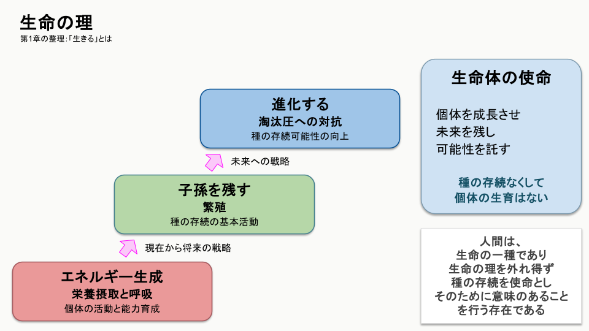
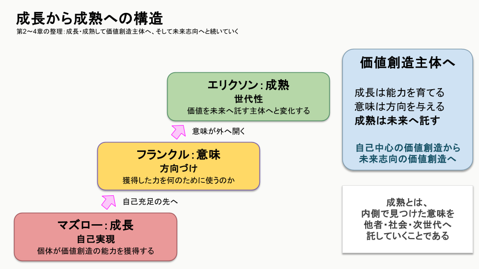
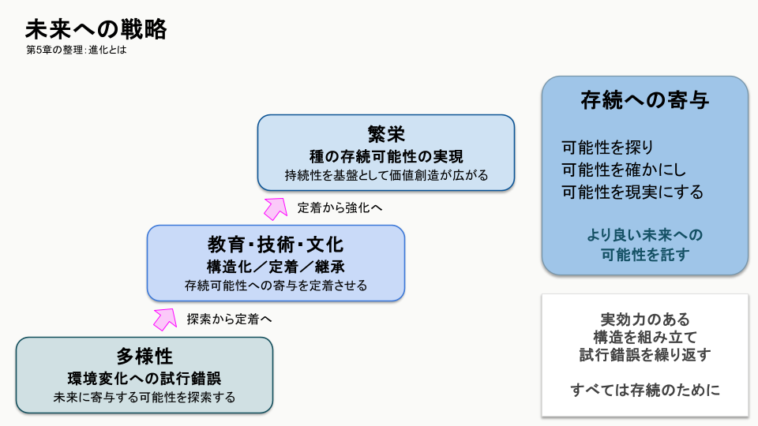
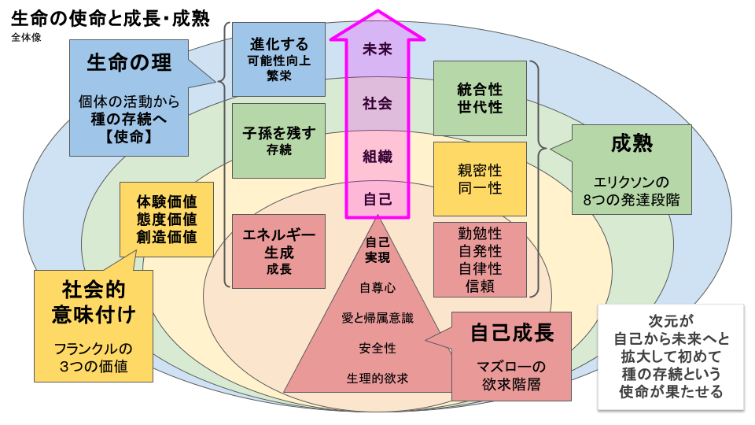

成長と成熟の構造 ― 人間社会の持続性を支える価値創造主体 ―
=================================================

2026-8-28  
NECソリューションイノベータ株式会社  
イノベーションラボラトリ  
技術戦略グループ  
オープンソース戦略プロフェッショナル  
武藤　周

© 2026 Shu Muto  
Licensed under the Creative Commons Attribution 4.0 International License (CC BY 4.0).

---

# まえがき

大学時代（1990年代）、生物学の授業で「生命とは何か」という定義を学んだ。

生命の定義には諸説があり、ひとつに定めることは難しい。そう説明されたうえで、私は次の考え方を知った。

生命とは、

* エネルギーを生成し、
* 子孫を残し、
* 進化する

存在である。

教員自身による整理だったと記憶しているが、それが、どの学説の、誰の言葉が由来なのかは、いまでは分からない。

ただ、この定義だけは、三十年以上、私の中に残り続けた。

残ったというより、私はこの定義を使って考え続けてきた。

人は、なぜ働くのか。  
なぜ成長を求めるのか。  
なぜ子を育て、知識を伝え、文化を残すのか。  
あるいは、なぜ組織、社会、文明は栄枯盛衰があるのか。  
そして、「生きる」とはどういうことなのか。  

そうした問いに向き合うたびに、私は生命の三つの営みに立ち返った。

エネルギーを生成する。  
子孫を残す。  
進化する。  

少なくとも月に一度は、この生命観を通して、人間や社会について考えてきたと思う。仕事、家族、教育、組織、技術、文化、制度、社会。対象は変わっても、出発点は変わらなかった。

もちろん、三十年間考え続けたことによって、この定義が生物学的に証明されたわけではない。

私が行ってきたのは、学術的な実験ではない。自らの経験と、身の回りで起こる出来事と、人間社会の歴史に、この考え方を繰り返し当てはめて考えてきただけである。

それでも、この生命観から考えたとき、現実との間に決定的な矛盾を感じたことは一度もなかった。

そして、考え続けるほどに、生命の営みと人間社会の営みは、同じ理の上にあると確信を深めてきた。

生命がエネルギーを必要とするように、人間社会は活動するための力を必要とする。

生命が子孫を残すように、人間社会は自らを越えて、価値を受け渡そうとする。

生命が環境の変化の中で進化してきたように、人間社会も持続するためには変化し続けなければならない。

また、人間は生命でありながら、その営みを本能だけに委ねてはいない。

人は、何を残すかを選ぶ。  
何を受け継ぎ、何を拒むかを考える。  
どのような変化を望むかを決める。  
そして、自分には来ない次の時間へと何かを託すことができる。

本書では、その時間を「未来」（未だ来たらず）と呼ぶ。

未来とは、待っていれば訪れる時間ではない。

> 未来は、生み、育て、託すものである。

私たちが実際に活動し、学び、経験するのは、自らが体験するであろう将来（将に来たらんとす）のためである。だが、生命の営みは自らの将来だけでは完結しない。人は、自分が経験できない次の時間に向けて、子を育て、知識を残し、制度をつくり、文化を受け渡す。先祖の人々がやってきたように。

未来は、なんなら自分には来ない。  
それでも、生命はそこへ向けて働き続ける。

本書でいう「生きる」とは、単に存在していることではない。

生命の理を実践することである。

> エネルギーを生み、  
> 価値を次へ受け渡し、  
> 持続可能性を高めるために変化し続ける。

人において、それは成長し、意味を見いだし、成熟し、進化することとして現れる。

本書は、生命の厳密な定義を確定するためのものではない。また、人間社会のあらゆる問題をひとつの理論で説明しようとするものでもない。

三十年以上、私が手放すことなく考え続けてきた生命観を、ひとつの筋道として記すものである。

約四十億年にわたり、生命は途切れることなく営みを受け渡してきた。その連なりの末に、今、私はここに存在している。  
この事実をたどるだけでも、同じ生命観に行き着いたのかもしれない。  
だが、この生命観を揺るぎないものにしているのは、生物学を学び、生命の奇跡的とも言える精緻な仕組みに触れた経験があるからだ。

もし私たちが、自らの成長だけでなく、自らを越えた時間へ何を託すかを考えることができるなら。

そして、受け継いだものを守るだけでなく、未来の可能性を損なわないよう変化することができるなら。

人は「生きる」ことをより深く誇りに思える。

私は、そう信じている。

---

# 目次

* 第1章：生命の定義と理
* 第2章：成長という理
* 第3章：意味という理
* 第4章：成熟という理
* 第5章：進化という理
* 第6章：価値創造主体と構造
* 第7章：文化という理
* 第8章：千年の計 ― 教育と持続性 ―
* 第9章：人間社会の持続性という問い

---

# 第1章：生命の定義と理

## 1.1 なぜ生命から考えるのか

本書は、人間社会を論じる本である。

* 成長とは何か。
* 人は何のために働くのか。
* なぜ知識を継承し、文化を育み、組織をつくり、社会を築くのか。
* そして、「生きる」とはどういうことなのか。

本書は、これらの問いを考察する。  
しかし、その出発点を心理学にも、経営学にも、哲学にも置かない。

> 生命に置く。

理由は単純である。

> **人間は生命だからである。**

人間が営む教育も、企業も、国家も、文化も、技術も、人間社会という生命の営みから生まれている。  
であるならば、それらを理解するためには、人間だけを見ても十分ではない。

> その根底にある、生命そのものの営みへ立ち返る必要がある。

約四十億年にわたり、生命は途切れることなく受け継がれてきた。  
その間、環境は幾度となく変化し、多くの種が生まれ、そして絶滅した。  
それでも生命は続いてきた。

本書では、この生命が長い年月をかけて実践してきた営みを**生命の理**と呼ぶ。

> 生命の理とは、生命が未来へ続くために実践してきた原理である。

人間社会もまた、その例外ではない。

* 人は生命として成長し、
* 意味を見いだし、
* 成熟し、
* そして変化し続ける。

本書では、この一連の営みを生命の理という視点から読み解き、  
**人間社会における「生きる」とはどういうことなのか**、を考察していく。 

---

## 1.2 生命とは何か

生命とは何か。

この問いには様々な答えがある。

本書では、人間社会を考えるための最小限の定義として、生命を次のように捉える。

生命とは、

* エネルギーを生成し、
* 子孫を残し、
* 進化できる

存在である。

エネルギーを生成できなければ生命活動は維持できない。

子孫を残せなければ生命はそこで途絶える。

進化できなければ、環境変化に適応できず、絶滅のリスクとなる。

この三つは生命を成立させる条件である。

それは自然にサイクルを含むものであり、  
つまり、この定義は**個体**を対象としていない。  
生命の主体は、個体ではなく、**種**である。

---

## 1.3 種として生命を見る

一個体は必ず死ぬ。

どれほど優れた個体であっても、永遠に生き続けることはできない。

一個体だけを見れば、「子孫を残す」ことも、「進化する」ことも成立しない。

生命が約四十億年にわたり存続してきたのは、個体が長生きしたからではない。

世代を超えて生命が受け渡されてきたからである。

したがって、本書で生命というとき、それは個体ではなく、**種**を意味する。

生命とは、種として未来へ続く営みなのである。

---

## 1.4 生命の理

生命の定義から導かれるものを、本書では**生命の理**と呼ぶ。

生命の理において、最も重要なのは進化ではない。  
多様性でも、繁栄でもない。

**種として存続すること**である。

存続しなければ、

* 子孫も、
* 進化も、
* 繁栄も、

すべて意味を失う。

したがって、本書では**持続性**を生命の必須条件と位置付ける。

生命はまず続かなければならない。

続いて初めて、より良くなることに意味が生まれる。

ここで重要なのは、**進化は目的ではない**ということである。

> 進化とは、**種としての持続可能性を確保するための能力**である。

生命を取り巻く環境は常に変化する。  
環境が変化すれば、これまで有効だった生存戦略は通用しなくなるかもしれない。  
そのため生命は変化し続ける。  
変化そのものを目的としているのではない。

> **種としての持続可能性を確保するために、変化する能力を獲得してきたのである。**

しかし、進化は持続性を保証するものではない。  
進化できない生命は、環境変化への適応力を失い、絶滅のリスクを高める。

一方で、進化しても環境条件や外部要因によって絶滅することはあり得る。  
あるいは、進化せずとも閉ざされた環境で細々と生きながらえる生命もある。

だからこそ、本書では、進化を持続性そのものではなく、**持続可能性を高めるための能力**として位置付ける。

---

## 1.5 多様性と繁栄

進化は一つの方向へ進むものではない。  
生命は様々な可能性を試みる。

> その源泉となるのが**多様性**である。

多様性とは、進化の可能性である。

異なる個体や異なる戦略が存在することで、環境変化への適応可能性が広がる。  
しかし、多様性そのものが目的ではない。

> 多様性は、種としての持続可能性を高めるための性質である。

そして、多様性が十分に機能し、持続性が長期にわたって確保されたとき、生命は**繁栄**する。

本書でいう繁栄とは、一時的な成功や個体数の増加を意味しない。  
また、細々と生き延びている状態も繁栄とは呼ばない。

繁栄とは、

> **持続性を基盤とし、多様性による価値創造が継続している状態**

を指す。

> 持続性は繁栄の前提条件であり、  
> 繁栄はその上に築かれる理想状態である。

---

## 1.6 人間社会という生命の実践

人間も生命である。  
したがって、人間社会もまた生命の理から逃れることはできない。

しかし、人間は生物としてだけではなく、文化を持つ存在である。

* 教育を行い、
* 知識を継承し、
* 組織をつくり、
* 社会を形成する。

これらは生命の理に反するものではない。

むしろ、

> 生命の理を社会という形で実践した結果である。

人間社会では、

* 個体を成長させ、
* やがて次世代を育み、
* 文化を継承する。

それは生命における

* エネルギー、
* 子孫、
* 進化

を、人間社会が独自の方法で実現した姿である。

ここで、本書における「生きる」という言葉の意味を明確にしておきたい。

本書で「生きる」とは、

* 単に生命活動を維持することでも、
* 個人が成長することでも、
* 自己実現することでも

ない。

生命の定義を実践することである。  
すなわち、

* エネルギーを生成し、
* 未来へ価値を受け渡し、
* 持続可能性を高めるために変化し続けること

である。

したがって、

> 「個体の成長」は「生きる」ことではない。

それは生命の第一段階であるエネルギー生成の過程に当てはまる。  
生命は、個体の中では完結しない。

種として未来へ続く営み全体を、本書では「生きる」と呼ぶ。

現代社会では、「生きる」という言葉は、個人の幸福や自己実現という意味で使われることが少なくない。  
それらは人間にとって重要な営みである。

しかし、本書では、それらを生命の営み全体と同一視しない。

個人の成長は重要である。  
だが、それは生命の出発点であり、終着点ではない。

_**図1: 生命の理**_

本書は、人間を価値創造主体として捉え直し、その営みがどのように未来へつながるのかを考察する。

次章では、その第一段階である「成長」、すなわちエネルギー生成について考える。

---

> **「生命は、個体では完結しない」**  
> **「しかし、生命の理は個体の成長から始まる」**

---

# 第2章：成長という理

## 2.1 成長とは何か

生命の定義において、最初に現れる要素は**エネルギー生成**である。

生命は、自ら活動を維持するためのエネルギーを獲得しなければならない。  
個体が成長するとは、このエネルギー生成能力を高める過程である。

* 身体をつくる。
* 知識を得る。
* 技術を身につける。
* 経験を積む。

これらはすべて、生命が自己を維持し、活動するための能力を獲得する営みである。

人間社会でも同じである。

* 子どもは教育を受ける。
* 技術者は技術を学ぶ。
* 企業は利益を蓄え、人材を育成する。
* 国家は産業や社会基盤を整備する。

これらはすべて、価値創造主体が持つエネルギー生成能力を高める活動である。

したがって、本書では**成長を「エネルギー生成」の段階**として位置付ける。

---

## 2.2 マズローが示した成長

人間の成長を説明する理論として、最も広く知られているものの一つがマズローの欲求階層説である。

マズローは、人間の欲求を、

* 生理的欲求
* 安全欲求
* 所属と愛情
* 承認欲求
* 自己実現欲求

という段階として整理した。  
後年には自己超越という概念も加えられた。

この理論は、人が何を求め、どのように能力を高めていくのかを説明するものとして、大きな影響を与えた。

教育、人材育成、経営学など、多くの分野で現在も引用されている。

---

## 2.3 マズローは生命を説明していない

しかし、本書ではマズローを生命の理という視点から読み直す。

マズローが説明したのは、**個体の成長**である。  
生命の定義に照らせば、これは**エネルギー生成**に対応する。

* 安全を求めること。
* 能力を伸ばすこと。
* 自己実現を目指すこと。

これらはすべて、

> 個体が価値を生み出す能力を高める営みである。

しかし、生命の定義は、エネルギー生成だけでは終わらない。

生命は、

* 子孫を残し、
* 進化できて初めて、

生命として成立する。

つまり、

> マズローは生命の一部を説明したのであって、

生命そのものを説明したのではない。

---

## 2.4 成長で止まる社会

ここで現代社会を見てみよう。

* 「自分らしく生きる」
* 「人生を楽しむ」
* 「自己実現する」

こうした言葉は数多く語られている。  
これらを否定するつもりはない。

しかし、本書ではそれらを**生命の全体像**とは考えない。

これらはいずれも、

> 個体の成長、

すなわちエネルギー生成の段階を語っているに過ぎない。

生命は、個体で完結しない。

> 未来へ価値を受け渡し、  
> さらに環境の変化に適応しながら持続可能性を高めていく営みである。

もし社会全体が成長だけを目的とするなら、生命の理は途中で止まる。

個体の充実だけを追求し、次世代への継承が弱くなれば、

> 少子化は進み、知識は失われ、  
> 組織は後継者を育てられなくなる。

これは単なる人口問題ではない。  
生命の理から見れば、**エネルギー生成だけが肥大化した状態**なのである。

---

## 2.5 成長は未来への準備である

では、成長とは何のためにあるのか。  
本書では、成長を目的とは考えない。

成長とは、

> 未来へ価値を受け渡すための準備

である。

* 知識を学ぶのは、知識を残すためでもある。
* 技術を磨くのは、未来の価値を生み出すためでもある。
* 組織を育てるのは、次世代へ受け継ぐためでもある。

エネルギー生成とは、未来へ向かうための基盤なのである。

---

## 2.6 成長の限界

成長は生命にとって不可欠である。

* 身体を鍛える。
* 知識を学ぶ。
* 技術を身につける。
* 社会的な能力を高める。

これらはすべて、生命が価値を創造する能力を獲得する過程である。

しかし、成長そのものは目的ではない。

どれほど能力を高めても、

> その能力が未来へ向かわなければ、生命の理は完結しない。

成長とは、

> 価値を創造する力を獲得すること

であり、その力を何のために使うのかという問いには答えない。  
そこではじめて、

> 人は「意味」を求め始める。

---

> **「成長は、価値を創造する力を与える」**
> **「意味は、その力に方向を与える」**

---

# 第3章：意味という理

## 3.1 成長だけでは満たされない

能力は十分に身についた。  
生活にも困らない。  
社会的にも評価されている。  
それでも、人はなお問い続ける。

> 「この力を何のために使うのか。」

成長が進むほど、この問いは避けられなくなる。  
成長は能力を与える。しかし、能力だけでは方向は決まらない。

---

## 3.2 フランクルが示した意味

ヴィクトール・フランクルは、人間は意味を求める存在であると述べた。

* 人生には苦しみがある。
* 失敗もある。
* 喪失もある。

それでも、**自らが意味を見いだした人は、困難を乗り越えられる**。

フランクルは、**人間の精神的な強さの源泉**として「意味」を位置付けた。

この考え方は、現代に至るまで多くの人々へ影響を与えている。

---

## 3.3 意味は使命ではない

本書は、フランクルの理論を否定しない。

しかし、生命の理という視点から見るなら、

> 意味は終着点ではない。

本書でいう「生きる」とは、

> 生命の定義を実践することである。

生命は、

* エネルギーを生成し、
* 子孫を残し、
* 進化する。

これが**生命の使命**である。

したがって、

> 「生きることに意味はない。」

これは、生きることが無意味であるという意味ではない。  
生命である以上、「生きる」ことは既に与えられた至上の使命だからである。

意味とは、

> その使命をどのような形で実践するのか

を定めるものである。

* 教育に意味を見いだす人もいる。
* 人命を救うことに意味を見いだす人もいる。
* 新しい知を生み出すことに意味を見いだす人もいる。
* より良い社会を築くことに意味を見いだす人もいる。

意味は人によって異なる。

しかし、

> その先にある使命は共通して「生きる」こと、

つまり「生命の理を実践する」ことである。

---

## 3.4 意味は使命を自覚する萌芽である

人は、

> 最初から生命の使命を意識しているわけではない。

まず、

* 自分にできることを知る。
* 能力を身につける。
* 社会の中で役割を得る。

そして、

> 「この力を何のために使うのか。」

と考え始める。

この問いこそが、

> 生命の使命を意識し始める萌芽である。

意味は、

> 使命そのものではない。

しかし、

> 意味を見いだすことで、
> 人は自己の外側へ目を向け始める。

未来へ。  
次世代へ。  
社会へ。

ここから、

> 成熟が始まる。

---

## 3.5 意味は未来へ向かう

意味を持つことは、単なる満足ではない。

意味は、**未来へ向かう力となる**。

* 知識を残したい。
* 技術を伝えたい。
* 弟子を育てたい。
* 社会を良くしたい。

それぞれ形は違う。

しかし共通しているのは、

> 自分の外側へ価値を向けていることである。

意味とは、

> **未来への**方向づけ、動機づけなのである。

---

## 3.6 意味から成熟へ

生命の理において、

> 意味は終着点ではない。

意味は、

> 使命を自覚し、
> 未来へ歩き始める第一歩である。

その歩みが、

* 次世代の育成となり、
* 知識の継承となり、
* 文化の形成となるとき、

> 人は成熟する。

次章では、

> この「未来へ価値を受け渡す」という営みを、

成熟という視点から考察する。

---

> **「意味は使命を自覚する萌芽」**  
> **「その使命を実践する価値創造主体」**

---

# 第4章：成熟という理

## 4.1 成熟とは何か

意味を見いだしただけでは、生命の理は実践されない。

意味は方向を与える。

> しかし、その方向へ歩み出さなければ、未来は変わらない。

本書では、この歩みを**成熟**と呼ぶ。

> 成熟とは、未来へ価値を受け渡す主体へと変化することである。

それは単に年齢を重ねることではない。  
知識や経験が増えることでもない。

> 自らが獲得した能力を、自分のためだけではなく、未来のために用いるようになることである。

---

## 4.2 エリクソンが示した成熟

エリク・エリクソンは、人間の発達を八つの段階として整理した。

その中でも成人期の重要な課題として示したのが、**Generativity（世代性）**である。  
Generativityとは、次世代を育み、社会へ貢献し、未来を支える営みを指す。

子どもを育てることだけではない。

* 後進を育成すること。
* 知識を伝えること。
* 組織を育てること。
* 社会へ貢献すること。

これらはすべて、Generativityの表れである。

エリクソンは、人間が自己の外側へ関心を広げることを成熟の重要な特徴として捉えた。

---

## 4.3 子孫とは何か

生命は子孫を残す。  
生物学では、それは遺伝子の継承を意味する。

しかし、人間社会では、それだけではない。

* 教育は知識を継承する。
* 文化は価値観を継承する。
* 技術は技能を継承する。
* 組織は経験を継承する。
* 制度は社会の秩序を継承する。

つまり、人間は**価値そのもの**を未来へ受け渡すことができる。

本書では、この**広い意味での継承もまた、「子孫を残す」という生命の理の実践**として捉える。

---

## 4.4 人は価値創造主体になる

本書では、価値を創造し、その価値を未来へ受け渡す主体を「価値創造主体」と呼ぶ。

* 成長は、自らの能力を高める。
* 意味は、その能力に方向を与える。
* 成熟は、その能力を未来へ受け渡す。

ここで初めて、人は**価値創造主体**となる。

価値を創ることだけでは十分ではない。

> その価値が、自分の人生とともに失われてしまえば、生命の理は途切れてしまう。

成熟した主体は、価値を未来へ接続する。

だからこそ、

* 教育がある。
* 育成がある。
* 協働がある。
* 継承がある。

> 価値創造主体とは、自ら価値を創り、その価値を未来へ受け渡す主体なのである。

---

## 4.5 成熟は個人を超える

成熟とは、自分を犠牲にすることではない。  
自己実現を否定することでもない。

むしろ、十分に成長した者だからこそ、他者を育み、社会へ価値を返すことができる。

成熟とは、

> 自己中心的な価値創造から、
> 未来中心の価値創造への転換

である。

それは、

* 親が子を育てる姿かもしれない。
* 教師が学生を育てる姿かもしれない。
* 経営者が次世代の経営者を育てる姿かもしれない。
* 政治家が数年後ではなく数十年後の社会を考える姿かもしれない。

形は異なっても、本質は同じである。

> 未来へ価値を受け渡すこと。

それが成熟である。

_**図2: 成長から成熟への構造**_

---

## 4.6 成熟だけでは持続しない

しかし、成熟にも限界がある。

どれほど価値を継承しても、

> 環境が変化すれば、  
> 昨日までの価値がそのまま通用するとは限らない。

* 知識は更新される。
* 技術は進歩する。
* 社会は変化する。

> 継承だけでは、やがて価値は時代に取り残される。

生命は、価値を受け渡すだけではなく、変化し続けることで約四十億年を生き抜いてきた。  
人間社会もまた、その例外ではない。

次章では、この「変化し続ける」という生命の理について考える。

---

> **「成熟は、価値を未来へ受け渡す」**  
> **「進化は、その価値を未来に適応させ続ける」**

---

# 第5章：進化という理

## 5.1 継承だけでは持続しない

成熟した価値創造主体は、未来へ価値を受け渡す。  
それは生命の理における「子孫を残す」という営みであった。

しかし、それだけでは十分ではない。

* 社会は変化する。
* 技術は進歩する。
* 価値観は変わる。
* 環境もまた変化し続ける。

昨日まで価値があったものが、明日も価値を持つとは限らない。

継承だけを繰り返せば、

> やがて社会は変化から取り残される。

生命は、

> 継承すると同時に、  
> 変化する能力を獲得した。

だからこそ、

> 種として未来へ続くことができたのである。

---

## 5.2 進化とは何か

本書では、

進化を

> **持続可能性を高めるために変化し続ける能力**

と定義した。

ここで重要なのは、

> 変化すること自体に価値はないということである。

* 流行を追うこと。
* 新しい技術へ飛びつくこと。
* 過去を否定すること。

これらは進化ではない。

進化とは、

* 未来へ続くために、
* 何を変え、何を変えないかを
* **判断する営み**である。

目的は変化ではない。

目的は、

> あくまでも**生命として持続すること**である。

---

## 5.3 人間社会の進化

人間は、遺伝子だけで未来へ適応してきたわけではない。

* 知識を積み重ねる。
* 制度を改善する。
* 技術を発展させる。
* 文化を育む。

そして、

> これらを共有し、知恵を出し合い、切磋琢磨してきた。

これこそが、

> 人間社会が獲得した進化の仕組みである。

人間社会では、

> 一人の人生では到底成し得ない変化を、  
> 世代を超えて積み重ねることができる。

これこそが、

> 人間社会の持つ最大の強みである。

---

## 5.4 不確実性の中で進化する

未来を完全に予測することはできない。  
だからといって、立ち止まることはできない。

このような態度は、**ネガティブ・ケイパビリティ**という概念にも通じる。

未来が分からないからといって、安易な答えで不確実性を閉じてしまわない。  
矛盾や曖昧さを抱えたまま、それでも観察し、試し、考え続ける。

> **成熟とは、答えを早く持つことではない。**  
> **答えを急がず、不確実性の中でも判断し続けられることでもある。**

未来を完全に予測できない以上、進化に必要なのは「正解を知っていること」ではなく、  
**正解がまだ存在しない状態に耐えながら、可能性を残し続ける能力**なのである。

生命は、**約四十億年にわたり**、

> 変化を繰り返して、未来に備えてきた。

その歩みは、試行錯誤の連続であった。

人間社会もまた同じである。

* 未知を受け入れる。
* 多様な可能性を残す。
* 失敗から学ぶ。

そして、

> 未来に備えて自らを変えていく。

進化とは、

> 未来を予測する能力ではない。  
> 未来に備え続ける能力なのである。

---

## 5.5 多様性は未来への可能性である

本書では、多様性を**進化の可能性**と位置付けた。

多様性とは、現在のためだけに存在するものではない。  
未来には、どのような環境が訪れるか分からない。

だからこそ、

* 様々な考え方、
* 様々な経験、
* 様々な技術、
* 様々な価値観

が存在することに意味がある。

多様性とは、

> 未来を生み出す可能性である。

---

## 5.6 価値創造主体は進化し続ける

価値創造主体は、価値を創る。  
価値を未来へ受け渡す。

そして、

* 受け継いだ価値を問い直し、
* 磨き、
* 新たな価値を創り出す。

この循環が続く限り、

> 社会は持続可能性を高め続けることができる。

* 成長する。
* 意味を見いだす。
* 成熟する。

そして、

> **存続に寄与する**変化をし続ける。

これが、

> 本書でいう「生きる」である。

_**図3: 未来への戦略**_

_**図4: 生命の使命と成長・成熟**_

---

> 生命は約四十億年にわたり、成長し、価値を受け渡し、変化し続けることで種としての持続可能性を高めてきた。  
> 人間社会もまた、その生命の理の上にある。  
> 企業も、教育も、政治も、科学も、技術も、この理から逃れることはできない。

本書の後半では、この生命の理を基盤として、価値創造主体がどのように組織、社会、そして文明へと広がっていくのかを考察する。

---

> **「一人の成熟だけでは、社会は持続しない」**  
> **「価値創造主体が互いに接続され、構造と結合するとき、個人を超えた持続性が生まれる」**

---

# 第6章：価値創造主体と構造

## 6.1 一人の成熟だけでは持続しない

ここまで、人間を一人の価値創造主体として見てきた。

* 人は成長する。
* 意味を見いだす。
* 成熟する。

そして、

> 受け継いだ価値を未来へ託しながら、存続に寄与する変化を続ける。

しかし、一人の人間がどれほど成熟しても、その人はいつかいなくなる。

* 優れた技術者も、
* 優れた教師も、
* 優れた経営者も、
* 優れた政治家も、

永遠には存在しない。

それだけではない。  
一人の人間が、自らの持つ価値を未来へ受け渡すことそのものにも限界がある。

* 知識を伝えるには、受け取る人が必要である。
* 新しい価値を生み出すには、異なる知識や経験を持つ人との接続が必要になる。
* 次世代を育てるにも、教育する人だけでは成立しない。
* 自らがいなくなった後にも価値創造を続けるには、それを支える環境が必要である。

つまり、

> 一人の成熟だけでは、持続性は生まれない。

生命の理が個体だけでは完結しないように、人間社会の営みも、一人の価値創造主体だけでは完結しない。

成熟した主体に求められるのは、**すべてを自ら成し遂げることではない**。

むしろ、

> **自分だけでは未来をつくれないことを理解し、自らを他の主体と構造へ接続すること**

なのである。

---

## 6.2 価値創造主体は互いに接続する

人間社会では、価値創造主体は孤立して存在しているわけではない。

* 人は他者から学ぶ。
* 他者へ教える。
* 異なる経験を持つ人と協働する。
* 時には対立し、
* 議論し、
* 理解できないものと向き合いながら、
* 自らの考えを変えていく。

そこでは、価値は一方向に受け渡されるだけではない。

> 複数の主体の間を行き交い、その相互作用によって新しい価値へ変化する。

たとえば、一人の技術者が知識を持っているだけなら、その知識は個人の能力である。

* 別の技術者へ伝えれば、知識は共有される。
* 異なる知識を持つ人々が協働すれば、それまで存在しなかった技術が生まれるかもしれない。
* さらに、その技術を学んだ人が別の場所で新しい使い方を考えれば、価値は再び変化する。

これは単なる情報伝達ではない。

> **価値創造主体同士の相互作用そのものが、価値を生み出している。**

だからこそ、多様性にも意味がある。

* 異なる主体が存在し、
* 異なる知識を持ち、
* 異なる経験を持ち、
* 異なる判断をする。

それらが接続されることで、未来の可能性は広がる。

しかし、主体同士が偶然出会うことだけに依存していては、その営みは安定しない。

そこで必要になるのが、

> **構造である。**

---

## 6.3 構造とは何か

構造というと、組織図や制度を思い浮かべるかもしれない。

しかし、本書でいう構造は、それだけではない。

* 組織図を作っただけでは、人は協働しない。
* 規則を書いただけでは、価値は生まれない。
* プロセスを定義しただけでは、価値は未来へ受け渡されない。

本書では、構造を、

> **価値創造主体同士の接続と相互作用を支え、価値創造を継続可能にする仕組み**

と捉える。

そこには、

* 人と人を接続する場
* 役割と責任
* 意思決定の仕組み
* 知識を共有する仕組み
* 学習や教育の仕組み
* 外部と接続する経路
* 新しい主体が参加できる経路
* 価値を次へ受け渡す仕組み

などが含まれる。

制度や組織、プロセス、文書は、そのための手段である。

構造の目的は、これらの手段そのものを維持することではない。

> **主体同士の相互作用を持続させることにある。**

---

## 6.4 主体と構造は互いをつくる

では、構造は誰がつくるのか。

> もちろん、人がつくる。

しかし、

> **一人の成熟した主体が構造を完成させるわけではない。**

これは重要な観点である。

価値創造主体は、

* 他者へ働きかける。
* 知識を共有する。
* 必要な仕組みを提案する。
* 他の主体を接続する。
* 既存の制度へ働きかける。
* 時には新しい制度をつくる。

しかし、それらを一人ですべて担う必要はない。

> そもそも、構造とは複数の主体の相互作用を支えるものである。

その構造を一人の主体だけに依存してつくるなら、構造をつくる営みそのものが個人依存になってしまう。

必要なのは、

> **主体が他の主体と接続し、その相互作用の中から構造が形成されること**

である。

そして、一度形成された構造は、今度は主体を支える。

* 学ぶ場があるから、新しい人が参加できる。
* 知識が共有されているから、過去の経験を引き継げる。
* 役割が分担されているから、一人ですべてを担わなくてよい。
* 意思決定の仕組みがあるから、特定の一人が常に判断しなくてよい。
* 他者と接続する経路があるから、新しい価値を取り込むことができる。

つまり、

> **主体が構造を形成し、構造が主体を支え、育てる。**

さらに、育った主体が既存の構造を問い直す。

* 環境が変われば、構造を変える。
* 新しい主体が参加すれば、新しい関係が生まれる。

こうして主体と構造は、互いを変化させ続ける。

---

## 6.5 ヒーローに持続性を背負わせない

優れた一人が、大きな価値を生み出すことがある。

* 誰よりも深く理解し、
* 誰よりも行動し、
* 人をつなぎ、
* 問題を解決し、
* 価値を生み出す。

その存在は大きな力となる。

しかし、その人が、

* 価値を生み出し、
* 他者を育て、
* 知識を残し、
* 人々を接続し、
* 制度を整え、
* 資源を確保し、
* 対立を調整し、
* さらに自らの後継者まで育てなければならない

としたら、それは**持続可能な構造とはいえない**。

オープンソースの世界では、この問題が分かりやすく現れる。

優れたメンテナーがいる。

* コードを書く。
* レビューする。
* Issueに対応する。
* リリースする。
* 新しいコントリビューターを支援する。
* コミュニティを運営する。
* 企業との関係を調整する。
* 時には資金まで集める。

そのすべてが一人、あるいは少数の人間へ集中すれば、**やがて疲弊する**。

そして、その人が活動を続けられなくなったとき、

* 「後継者を育てなかった」
* 「持続可能な仕組みをつくらなかった」

と、その本人へさらに責任を負わせるなら、本末転倒である。

> **持続性をつくる責任までヒーローへ集中させれば、持続性そのものがヒーロー依存になる。**

未来へ価値を受け渡すには、

* 受け取る主体が必要である。
* 主体同士を接続する人も必要である。
* 教育を支える人も必要である。
* 資源を提供する人も必要である。
* 活動を社会へ翻訳する人も必要である。
* そして、それらを可能にする構造が必要である。

一人の成熟とは、

> すべてを背負えるようになることではない。

> **自らの有限性を理解し、他者とともに未来へ価値を託せるようになること**

でもある。

---

## 6.6 構造だけでも持続しない

一方で、構造をつくれば問題が解決するわけでもない。

持続性を求めると、人は構造を残そうとする。

* 制度をつくる。
* 規則をつくる。
* 組織をつくる。
* 文書を残す。

それらは重要である。

しかし、

> **構造が残ることと、それが価値として残ることは同じではない。**

* 制度は残っている。
* 組織も残っている。
* 規則も守られている。

それでも、

* なぜその制度が存在するのかを誰も説明できない。
* 何を守るための規則なのか分からない。
* 過去の判断を繰り返すことだけが目的となる。

そうなれば、構造は残っていても、

> その構造を生み出した**理**は失われている。

そして環境が変化すれば、かつて持続性に寄与した構造が、逆に変化を妨げることもある。

第5章で述べたように、

> **進化とは、何を変え、何を変えないかを判断しながら、存続に寄与する変化を続けることである。**

構造も例外ではない。

* 構造は守るためだけに存在するのではない。
* 必要なら変えなければならない。

その判断をするのは、

* 制度でも、
* 規則でも、
* 文書でも

ない。

**価値創造主体、つまり人である。**

だからこそ、

> **主体のない構造は動かず、構造のない主体は続かない。**

両者は相互に必要なのである。

---

## 6.7 個人の能力から自律的持続性へ

ここで、第1部『オープンイノベーションの構造』へ接続する。

第1部では、外部との接続から得られた価値が、組織内部へ変換され、さらに貢献や価値創造へと循環する構造を考察した。

そこでは、

* 一部の熱心な個人による活動から、
* 複数の人が参加し、
* 組織として価値を変換し、
* やがて自律的に活動が循環する状態への変化

を扱った。

本書の言葉で読み直せば、そこに必要なのは単なる制度ではない。

* 成熟した価値創造主体がいる。
* その主体が他の主体と接続する。
* 異なる主体が互いに価値を交換する。
* その相互作用を支える構造が形成される。
* 構造によって、新しい主体が参加し、育つ。
* 新しい主体が構造を問い直し、必要なら変える。
* そして、その循環が特定の一人に依存せず続いていく。

これが、

> **自律的持続性**

である。

自律とは、外部の助けを必要としないことではない。

むしろ逆である。

* 他者と接続し、
* 外部と接続し、
* 価値を受け取り、
* 価値を返し、
* 複数の主体がそれぞれ判断しながら、
* 特定の一人に依存せず循環を続けられること。

それが自律である。

したがって、

> **複数の価値創造主体が互いに接続され、その営みを支える構造と相互作用するとき、個人を超えた自律的持続性が生まれる。**

これは、第一部で扱った組織の構造と、ここまで扱ってきた生命の理が交わる場所でもある。

---

## 6.8 構造から文化へ

しかし、まだ一つ問題が残る。

構造が存在していても、そこにいる人々が、

* なぜその構造が必要なのか、
* 何を未来へ託そうとしているのか、
* 何を変えてよいのか、
* 何を守るべきなのか、

を理解していなければ、構造はいずれ形骸化する。

* 文書だけでは足りない。
* 制度だけでも足りない。
* 組織だけでも足りない。
* そして、誰か一人の理解だけでも足りない。

必要なのは、

> **理を理解する主体が社会の各所に存在し、その主体同士が接続されていること**

である。

* ある人が理解する。
* その人が実践する。
* 別の人がその実践に触れる。
* 議論する。
* 時には異なる解釈が生まれる。
* それでも、何を未来へ託すのかという問いを共有しながら、それぞれの立場で判断する。
* そして次の主体へ受け渡す。

ここまで来れば、

> 理はもはや一人の所有物ではない。

制度だけに記録されたものでもない。

> 多くの主体の判断と行動の中に存在するものになる。

それが世代を越えて受け渡されるとき、

> 構造はさらに深いものへ変わっていく。

次章では、その営みを**文化**という視点から考える。

---

> **「一人の成熟だけでは、持続性は生まれない」**  
> **「主体と主体、そして構造が相互作用し、その理まで未来へ受け渡されるとき、個人を超えた持続性が生まれる」**

---

# 第7章：文化という理

## 7.1 構造の先にあるもの

前章では、価値創造主体と構造の関係を考えた。

一人の成熟だけでは持続しない。

* 価値創造主体が互いに接続し、
* その相互作用を支える構造が生まれ、
* 構造が新しい主体を育て、
* その主体がまた構造を変えていく。

この循環によって、

> **個人を超えた自律的持続性が生まれる。**

しかし、それでも十分ではない。

* 組織は残っている。
* 制度も残っている。
* 規則も残っている。
* 教育の仕組みもある。

それなのに、

* なぜそれを行うのかを誰も知らない。
* 何を未来へ託そうとしているのかも分からない。

ただ、

> 「昔からそうしているから」

という理由だけで営みが繰り返される。

そこには構造が残っていても、

> **理は残っていない。**

構造を未来へ残すだけでは、人間社会は持続しない。

未来へ受け渡さなければならないのは、

> 構造を生み出した**理**そのものである。

その理が、多くの主体によって理解され、実践され、さらに次の主体へ受け渡される状態。

> 本書では、それを**文化**と呼ぶ。

---

## 7.2 文化とは何か

文化という言葉は広い。

* 芸術も文化である。
* 言語も文化である。
* 生活習慣も文化である。
* 企業には企業文化があり、
* 地域には地域文化があり、
* 国家にも文化がある。

しかし、本書では文化をもう少し限定して捉える。

> **文化とは、理が理解され、実践され、世代を超えて継承される状態である。**

ここで重要なのは、

文化とは**物そのものではない**ということである。

* 本に書かれた知識だけではない。
* 制度でもない。
* 建築物でもない。
* 規則でもない。

それらは文化を記録し、支えることはできる。

しかし、それらだけでは文化にならない。

たとえば、優れた思想を記した本が残っていても、

* 誰も読まず、
* 誰も理解せず、
* 誰も実践しなければ、

その思想は社会の中では働かない。

逆に、

* 明文化された規則がなくても、
* 人々がその理を理解し、
* 判断し、
* 行動し、
* 次の人へ伝えているなら、

そこには文化が存在する。

> 文化とは、**理が、人の中で働き続けている状態**

なのである。

---

## 7.3 文化は保存できない

人間は、未来へ価値を残そうとする。

そこで、

* 記録する。
* 本を書く。
* 映像を残す。
* データを保存する。
* 制度をつくる。
* 建物を残す。

それらは重要である。

しかし、

> **保存と継承は同じではない。**

情報を保存することはできる。  
知識も、ある程度は保存できる。

しかし、理を保存することはできない。  
なぜなら、理とは単なる情報ではなく、

> **それを理解した主体が、現実の中で判断し、実践することによって初めて働くもの**

だからである。

* 料理のレシピを残すことと、料理人を育てることは違う。
* 教科書を残すことと、学問を継承することも違う。
* ソースコードを保存することと、そのソフトウェアを発展させ続けられるコミュニティを残すことも違う。

記録は、過去の状態を保存する。

文化は、

> **受け継いだものを現在の主体が再び理解し、実践することで存在する。**

だから文化は、保存されるものではない。

> **実践され続けることでしか存在できない。**

---

## 7.4 文化は人と人との間にある

では、理はどのように継承されるのか。

* 本を読めばよいのだろうか。
* 授業を受ければよいのだろうか。
* マニュアルを読めばよいのだろうか。

もちろん、それらも重要である。

しかし、

> 人間が受け渡すもののすべてを言葉にすることはできない。

* 熟練した技術者は、どこを見るべきかを知っている。
* 教師は、同じ説明でも、生徒によって伝え方を変える。
* 医師は、検査値だけではなく、患者の様子を見る。
* 職人は、数値では表現しきれない違いを感じ取る。

それらの多くは、

* 経験し、
* 観察し、
* 失敗し、
* 他者と働く中で身につけていく。

そこでは、情報だけではなく、

> **判断の仕方そのもの**

が受け渡されている。

だからこそ、人間は

* 集まる。
* 教える。
* 学ぶ。
* 議論する。
* 一緒につくる。
* 失敗する。
* 時には衝突する。
* そして、互いの判断に触れる。

文化は、一人の中だけに存在するものではない。

> **文化は、人と人との相互作用の中に存在する。**

---

## 7.5 文化は要約できない

現代社会では、膨大な情報を効率よく扱うことが求められる。

* 長い文章は要約される。
* 経験は手順化される。
* 知識はデータベースへ格納される。
* 判断はルールへ変換される。
* そして、人工知能は膨大な情報から、必要な答えを短時間で生成できるようになった。

これは、人間社会が獲得した非常に強力な能力である。

しかし、ここには一つの危険がある。

> **情報を圧縮することと、文化を圧縮することは同じではない。**

* 結果だけを取り出せば、そこに至った過程が失われる。
* 成功した判断だけを残せば、なぜ別の可能性を捨てたのかが失われる。
* 規則だけを残せば、なぜその規則が必要になったのかが失われる。
* 結論だけを残せば、その結論を疑う能力が失われる。

そして環境が変わったとき、

> 過去の答えだけを持つ者は、新しい答えを生み出すことができない。

文化が受け渡すものは、答えだけではない。

> **答えを生み出すための理である。**

だから、情報や知性を安易にカプセル化し、

> 「これさえ残せばよい」と考えることはできない。

文化には、

* 人が人と関わり、
* 問い、
* 試し、
* 失敗し、
* 考え、
* 時には対立し、
* それでも再び考える

という、一見すると非効率な過程が必要になる。

その泥臭い相互作用の中で、理は初めて次の主体の中に根付く。

> **文化は要約できない。**

要約された情報を使って文化を学ぶことはできる。
しかし、

> 要約そのものは文化ではない。

---

## 7.6 文化は閉じれば衰える

文化を守ろうとすると、人はしばしば、それを変えないようにしようとする。

* 伝統を守る。
* 作法を守る。
* 過去の教えを守る。

それらには意味がある。

しかし、第5章で見た生命の理を思い出さなければならない。

> **持続するためには、変化する能力が必要である。**

文化も例外ではない。
文化を完全に固定すれば、環境の変化から取り残される。

だから文化は、

* 外部と接続する。
* 異なる文化と出会う。
* 異なる価値観と出会う。
* 異なる知識と出会う。

そこでは当然、
* 摩擦が生まれる。
* 自分たちの常識が通用しない。
* 理解できない考え方に出会う。
* 時には、自分たちが正しいと思っていたことを問い直さなければならない。

しかし、その相互作用こそが、文化に新しい可能性を与える。

> **閉じた文化は、継承することはできても、進化することが難しい。**

外部との接続は、文化を壊すためにあるのではない。

> **何を守り、何を変えるのかを問い続けるためにある。**

ここでもまた、

> 多様性は未来の可能性となる。

---

## 7.7 文化はエコシステムとして存在する

ここまで考えると、文化を一つの組織の所有物として捉えることは難しくなる。

* 知識は組織を越えて移動する。
* 人も移動する。
* 技術も移動する。
* 価値観も影響し合う。
* 教育機関で学んだ人が企業へ行く。
* 企業で経験を積んだ人が別の組織へ移る。
* 研究成果が産業へ使われる。
* 産業で生まれた課題が研究へ戻る。
* 地域社会の知恵が制度へ影響する。
* 異なる国の文化が互いに影響する。

そこでは、価値は一つの組織の内部だけで循環しているのではない。

> **社会そのものが、価値創造主体の巨大な接続系となっている。**

それを、**エコシステム**と捉えることができる。

エコシステムには、

* 単一の支配者はいない。
* 異なる主体が存在し、
* 互いに影響し、
* 時には競争し、
* 時には協力し、
* それぞれの営みが別の主体の営みを支える。

それは生命の生態系とよく似ている。

一つの主体がすべてを担うのではない。

> **異なる主体が互いに接続されることによって、全体として持続可能性を高める。**

人間社会の文化もまた、そのような相互作用の中で育まれる。

---

## 7.8 文化とは理の継承である

第1章から、ここまで辿ってきた。

生命は、エネルギーを生成する。

> 人間において、それは**成長**として現れる。

成長した人は、

> その能力を何のために使うのかという**意味**を見いだす。

意味が自己の外側へ向かうとき、

> 人は未来へ価値を託す**成熟した価値創造主体**となる。

しかし、一人では未来へ価値を受け渡せない。

> そこで主体は他の主体と接続し、
> その相互作用を支える**構造**をつくる。

そして、

* 構造の中で理を理解した主体が育ち、
* 互いに実践し、
* 問い直し、
* 新しい主体へ受け渡していく。

その状態を、

> 本書では**文化**と呼ぶ。

したがって、

> **文化とは、過去を保存することではない。**  
> **理を理解する主体を未来へ生み続けることである。**

文化が持続するとは、

> 同じ答えが永遠に繰り返されることではない。

次の主体が、

* 受け継いだ理をもとに、
* 自ら考え、
* 自ら判断し、
* 必要なら過去の答えを変え、
* さらに次へ託せること。

それこそが、文化の持続である。

そして、この営みを人間社会が意図的に行うために獲得した、最も重要な仕組みの一つがある。

**教育である。**

文化は、自然に残るものではない。  
未来へ託すためには、次の価値創造主体を育てなければならない。

次章では、

この営みをさらに長い時間軸から捉える。

---

> **「文化は、理が人から人へ受け渡され続ける状態である」**  
> **「教育は、その理を担う価値創造主体を未来へ生み続ける営みである」**

---

# 第8章：千年の計 ― 教育と持続性 ―

## 8.1 自分には来ない未来をつくる

ここまで、人間社会が未来へ続くための営みを考えてきた。

人は、

* 成長し、
* 意味を見いだし、
* 成熟し、
* 価値を未来へ託す。

しかし、一人では持続しない。

そこで、

* 他の主体と接続し、
* 構造をつくり、
* 相互作用し、
* 理を文化として継承する。

では、

> **どれほど先の未来まで考えればよいのだろうか。**

* 一年後だろうか。
* 十年後だろうか。
* 百年後だろうか。

私たちは通常、
> 自分が生きている時間の中で未来を考える。

* 個人なら数年後の生活を考える。
* 企業なら次年度の事業計画を考える。
* 政治なら次の選挙を考える。
* 国家なら数十年後の人口や経済を考えることもある。

しかし、生命の時間はそれよりはるかに長い。  
約四十億年にわたり、

> **生命は、自らが存在しない未来へ生命を受け渡し続けてきた。**

私たちもまた、その連なりの中にいる。

だとすれば、持続性を考えるとは、

> 自分の将来を考えることだけではない。
> **自分には来ない未来を考えることである。**

---

## 8.2 一年の計、十年の計、百年の計

中国古典『管子』には、後世「一年の計、十年の計、終身の計」などとして知られる一節がある。

そこでは、

* 一年を見通すなら穀物を植え、
* 十年を見通すなら木を植え、
* より長い時間を見通すなら人を育てる、

という趣旨が語られている。

この考え方は、本書でここまで述べてきた生命の理とよく重なる。

穀物を育てれば、比較的短い時間で実りを得ることができる。  
木を育てれば、その恩恵はより長く続く。  
しかし、

> **人を育てれば、その人がさらに価値を生み、別の人を育てることができる。**

ここには決定的な違いがある。

穀物や木が生み出す価値だけではない。  
育った人は、

> **自ら価値を創造する主体になる。**

そして、

* 学び、
* 考え、
* 判断し、
* 新しい価値を生み、
* 他者へ伝え、
* 次の主体を育てる。

つまり教育とは、

単に知識を渡す営みではない。

> **価値創造主体そのものを未来へ生み出す営みなのである。**

---

## 8.3 教育は何を継承するのか

教育というと、

知識や技能を教えることを考えやすい。

* 読み書きを教える。
* 数学を教える。
* 科学を教える。
* 技術を教える。
* 歴史を教える。

もちろん、それらは重要である。

しかし、第7章で見たように、

> **情報を渡すことと、文化を継承することは同じではない。**

* 答えを教えることはできる。
* 手順を教えることもできる。
* 過去の成功を教えることもできる。

しかし、未来の問題に対する答えを、私たちは知ることができない。

なぜなら、

> **未来の環境を完全に予測することはできない**

からである。

だから教育が未来へ受け渡さなければならないのは、  
過去の答えだけではない。

* なぜその答えに至ったのか。
* 何を大切にして判断したのか。
* 何を疑ったのか。
* 何を変え、何を守ったのか。
* 分からないものとどう向き合ったのか。

つまり、

> **答えを生み出すための理**

である。

教育とは、

> 過去の答えを未来へ保存する営みではない。  
> **未来の主体が、自ら答えを生み出せるようにする営みである。**

---

## 8.4 教育とは価値創造主体を育てることである

ここで、第2章から第5章までの議論へ戻る。

人は、

* まず成長する。
* 知識を得る。
* 技術を身につける。
* 経験を積む。

しかし、

> **能力を獲得するだけでは、生命の理は完結しない。**

その能力を何のために使うのか。

* 人は意味を見いだす。

そして、

* その意味が自己の外側へ向かい、
* 未来へ価値を託すようになったとき、
* 成熟した価値創造主体となる。

したがって教育も、能力の獲得だけで終わることはできない。

> **教育の目的は、優秀な個人をつくることではない。**

より正確には、それだけではない。

教育とは、

> **自ら学び、自ら考え、自ら価値を生み、その価値を未来へ託せる主体を育てる営み**

なのである。

だから教育には、知識だけではなく、

* 他者と関わること、
* 異なる考えに触れること、
* 試すこと、
* 失敗すること、
* 問うこと、
* 判断すること、
* 自分の判断に責任を持つこと、
* そして、得たものを次へ返すこと

が必要になる。

教育とは、

> **生命の理を実践できる主体を育てること**

なのである。

---

## 8.5 百年の計は教育にあり

日本では、

> 「国家百年の計は教育にあり」

という表現がしばしば使われる。

その意味は、生命の理から考えると明快である。

* 道路をつくることも重要である。
* 建物をつくることも重要である。
* 制度を整えることも重要である。
* 技術を残すことも重要である。

しかし、

それらを**未来において**

* 使い、
* 問い直し、
* 修復し、
* 変え、
* さらに新しい価値へつなげるのは、

> **人である。**

どれほど優れた制度を残しても、

> その理を理解する人がいなくなれば形骸化する。

どれほど優れた技術を残しても、

> それを理解し発展させる人がいなければ失われる。

どれほど多くの知識を保存しても、

> それを問い、組み合わせ、新しい知へ変える人がいなければ、
> 知識は過去の記録となる。

したがって、

> **社会の持続可能性を最後に支えるのは、次の価値創造主体を生み出せるかどうかである。**

教育が「百年の計」と呼ばれる理由は、教育の成果が百年間残るからではない。

> **教育された主体が、さらに次の主体を育てるからである。**

そこに、

> **世代を超えた循環が生まれる。**

---

## 8.6 保存する未来と、生きている未来

人間は、未来へ情報を残すための技術を発展させてきた。

* 文字。
* 紙。
* 印刷。
* 写真。
* 映像。
* デジタルデータ。

そして現在では、人類が生み出した膨大な情報を保存することができる。

GitHubは、オープンソースソフトウェアのリポジトリを1000年間にわたり未来へ継承するため、北極圏の地中深くに保管庫 **Arctic Code Vault** を設置した。

そこには、現代の人類が生み出したソフトウェアを、はるか未来へ残そうという意思がある。

それ自体には大きな意味がある。
しかし、本書の観点から見ると、一つの問いが生まれる。

> **コードが残れば、オープンソースは残るのだろうか。**

* コードそのものは残せる。
* 設計も残せる。
* 履歴も残せる。

しかし、

* なぜそのコードを書いたのか。
* なぜ他者へ公開したのか。
* なぜ知らない人の変更を受け入れたのか。
* なぜ議論したのか。
* なぜ自分の時間を使って他者へ教えたのか。
* なぜ異なる企業や国家の人々が一緒につくったのか。

その理まで、コードだけから受け取ることができるだろうか。

オープンソースを生きた文化として残すには、  
コードだけでは足りない。

> **その理を理解し、実践する人が必要である。**

これはオープンソースだけの話ではない。

人類が未来へ何かを残そうとするとき、保存するだけでは、  
その価値を生きたものとして継承することはできない。

> **保存された未来と、生きている未来は違う。**

---

## 8.7 木を植える

ジャン・ジオノの『木を植えた男』には、  
荒廃した土地へ、一人で木を植え続ける男が描かれる。

彼が植えた木の多くが育った姿を、  
彼自身が最後まで見るわけではない。

それでも、木を植える。

一本植える。  
また一本植える。

成果がすぐに現れるわけではない。  
誰かに評価されるためでもない。  
自分が利益を得るためでもない。

それでも、

> **自分には来ない未来のために、今できることを続ける。**

この姿は、本書で述べてきた成熟した価値創造主体の姿そのものである。

しかし、社会の持続性を一人の「木を植える男」に委ねてはいけないことも、第6章で見てきた。

必要なのは、一人の英雄ではない。

> **木を植える人を育てること。**

そして、

* その人たちが互いに接続され、
* なぜ木を植えるのかを理解し、
* それぞれの場所で判断し、
* また次の人へその理を託すこと。

そうなったとき、木を植えるという営みは、一人の行為から、

> **文化になる。**

---

## 8.8 千年の計

* 一年の未来を考えるなら、今必要なものを生み出せばよい。
* 十年の未来を考えるなら、長く価値を生み続けるものを育てればよい。
* 百年の未来を考えるなら、人を育てなければならない。

では、

> **千年の未来を考えるなら、何をすればよいのだろうか。**

千年後に必要な知識を、私たちは知らない。  
千年後に使われる技術も分からない。

国家も、企業も、制度も、  
現在と同じ姿で存在しているとは限らない。

だから、千年後のための答えを、今つくることはできない。

できることがあるとすれば、

> **未来の人々が、その時代の答えを自ら生み出せるようにすること**

である。

そのためには、

* 価値創造主体を育てる。
* 主体同士を接続する。
* 相互作用を支える構造をつくる。
* 理を文化として継承する。
* 外部との接続を保つ。
* 多様な可能性を残す。
* そして、その文化そのものを問い直し、変え続けられるようにする。

必要なのは、

完成された社会を未来へ渡すことではない。

> **未来をつくり続けられる社会を未来へ渡すこと**

なのである。

本書では、これを**千年の計**と呼びたい。

> **一年の計は、価値を生み出すこと。**
> **十年の計は、価値を育てること。**
> **百年の計は、価値創造主体を育てること。**
> **千年の計は、価値創造主体を生み続ける文化を育むこと。**

千年という時間に、特別な根拠があるわけではない。

それは、

> **自分にも、自分を直接知る人にも来ない未来**

を象徴する時間である。

そこまで時間軸を伸ばしたとき、  
持続性という言葉の意味は変わる。

持続性とは、

* 現在の制度を長く維持することではない。
* 現在の組織を永続させることでもない。
* 現在の価値観を固定することでもない。

> **未来の価値創造主体が、自ら未来をつくり続けられる可能性を残すことである。**

だから、千年の計に完成形はない。

私たちにできるのは、未来を決めることではない。

> **未来をつくる力を、未来へ託すことだけである。**

---

> **「教育は、未来の答えを教える営みではない」**  
> **「未来の答えを生み出せる価値創造主体を育てる営みである」**  
> **「千年の計とは、その主体を生み続ける文化を未来へ託すことである」**

---

# 第9章：人間社会の持続性という問い

## 9.1 生命から始めた問い

本書は、

> **生命とは何か。**

という問いから始まった。

生命とは、

* エネルギーを生成し、
* 子孫を残し、
* 進化できる

存在である。

この定義は、生物学として生命のすべてを説明するものではない。

しかし、人間社会を考えるための出発点として、この単純な生命観を置いた。  
なぜなら、

> **人間は生命だからである。**

人間がつくる組織も、制度も、教育も、文化も、  
生命である人間の営みから生まれている。

であるならば、

人間社会が

* なぜ存在し、
* なぜ成長し、
* なぜ未来へ何かを残そうとし、
* なぜ変化し続けるのか

という問いも、生命の営みから考えることができるのではないか。  
それが、本書の出発点だった。

そして、ここまで考えてきた結果、生命の三つの営みは、

> 人間社会において、より複雑な形となって現れていた。

---

## 9.2 成長から始まる

生命は、活動するためのエネルギーを必要とする。

人間もまた、

* 学び、
* 経験し、
* 技術を身につけ、
* 能力を高める。

本書では、これを**成長**と捉えた。

成長とは、

> **価値を創造する力を獲得すること**

である。

しかし、成長だけでは生命の理は完結しない。

どれほど多くの知識を得ても、  
どれほど優れた能力を身につけても、  
そこにはまだ一つの問いが残る。

> **「この力を、何のために使うのか。」**

そこで人は、

**意味**を求める。

意味は、獲得した力に方向を与える。

そして、その方向が、自分だけではなく、

* 他者へ、
* 社会へ、
* 次世代へ、
* まだ見ぬ未来へ

向かい始めたとき、人は**成熟**する。

---

## 9.3 成熟とは未来へ向かうことである

成熟とは、

* 年齢を重ねることではない。
* 知識が増えることでもない。
* 社会的な地位を得ることでもない。

本書では、

> **自らが獲得した能力を、未来へ価値を受け渡すために使うようになること**

を成熟と呼んだ。

そこではじめて、人は、

> **価値創造主体**

となる。

価値創造主体は、単に価値を生み出す人ではない。  
自らが得たものを、自分の中だけで完結させない。

* 知識を伝える。
* 人を育てる。
* 技術を残す。
* 社会をより良くする。
* 次の人が新しい価値を生み出せるようにする。

その営みは、

> 生命における「子孫を残す」という営みを、
> 人間が文化的な方法で実践している姿でもある。

しかし、

> **一人の成熟だけでは社会は持続しない。**

---

## 9.4 人は一人では未来をつくれない

どれほど成熟した価値創造主体であっても、

* 一人の人間には限界がある。
* 人はいつかいなくなる。
* 知識にも限界がある。
* 経験にも限界がある。
* 時間にも限界がある。

だから成熟とは、

> すべてを自分で背負えるようになることではない。

むしろ、

> **自分だけでは未来をつくれないことを理解すること**

でもある。

そこで、

価値創造主体は他の主体と接続する。

* 教える人と学ぶ人が接続する。
* 異なる知識を持つ人が接続する。
* 異なる経験を持つ人が接続する。
* 異なる組織が接続する。
* 社会と社会が接続する。

その相互作用から、

> 一人では生み出せなかった価値が生まれる。

そして、その相互作用を継続可能にするために、

人間は**構造**をつくる。

* 組織。
* 制度。
* 役割。
* 教育。
* 意思決定。
* 知識共有。
* コミュニティ。

しかし、

> 構造だけを残しても、社会は持続しない。

---

## 9.5 残すべきものは答えではない

* 制度は残すことができる。
* 規則も残すことができる。
* 本も残せる。
* 映像も残せる。
* ソースコードも残せる。

人間は、膨大な情報を未来へ保存できるようになった。

しかし、

> **保存と継承は同じではない。**

* なぜ、その制度をつくったのか。
* なぜ、その判断をしたのか。
* 何を守ろうとしたのか。
* 何を変えようとしたのか。
* 何を未来へ託そうとしたのか。

> その**理**が失われれば、  
> 残された構造はやがて形骸化する。

未来の環境は、現在とは異なる。

だから、

> 過去の答えをそのまま未来へ渡すだけでは、  
> 未来の人々を助けることはできないかもしれない。

必要なのは、

> **答えを残すことではなく、答えを生み出す力を残すことである。**

その理が人の中で

* 理解され、
* 実践され、
* 問い直され、
* 次の人へ受け渡され続け

ている状態。

それを本書では、

**文化**と呼んだ。

---

## 9.6 文化は未来を固定しない

文化というと、過去から受け継がれたものを守る営みのように見える。

しかし、本書でいう文化は、  
過去を固定するためのものではない。

> **未来の主体が、自ら判断するための理を受け渡すものである。**

だから、

* 文化は変化する。
* 外部と出会う。
* 異なる価値観と出会う。
* 時には衝突する。
* 自らの常識を疑う。

そして、

* 何を守り、
* 何を変えるのか

を考え続ける。

それは不安定にも見える。
しかし、

> 生命が約四十億年にわたり、変化することで持続可能性を高めてきたように、  
> 文化もまた、変化する能力を失えば持続できない。

> **継承とは、同じものを繰り返すことではない。**

受け継いだものを、

* 次の主体が自ら考え、
* その時代に必要な価値へ変え、
* さらに未来へ託すこと。

そこに、

> 人間社会の進化がある。

---

## 9.7 持続性とは何か

ここまで来て、ようやく本書の中心にある問いへ戻ることができる。

> **持続性とは何か。**

それは、

* 同じ組織が永遠に続くことではない。
* 同じ制度を守り続けることでもない。
* 同じ価値観を次世代へ押しつけることでもない。
* まして、変化しないことではない。

持続性とは、

> **未来の価値創造主体が、自ら未来をつくり続けられる可能性を残すこと**

である。

そのためには、

* 人を育てなければならない。
* 人と人を接続しなければならない。
* その相互作用を支える構造が必要になる。
* 理を文化として受け渡さなければならない。
* そして、その文化自身も、未来の主体によって問い直され続けなければならない。

したがって、

> 持続可能な社会とは、完成された社会ではない。

> **自らを変えながら、未来を生み出し続けることのできる社会**

なのである。

---

## 9.8 生命の理から人間社会へ

ここで、本書全体を一本につないでみよう。

生命は、

> **エネルギーを生成する。**

人間において、それは**成長**として現れる。

↓

成長によって得た能力に、

> **何のために使うのか**

という**意味**が生まれる。

↓

その意味が自己の外側へ向かうとき、人は、

> **未来へ価値を託す成熟した価値創造主体**

となる。

↓

しかし、一人では未来へ価値を受け渡せない。  
そこで、

> **主体と主体が接続し、その相互作用を支える構造**

が生まれる。

↓

構造の中で、理を理解する主体が育ち、実践し、問い直し、さらに次の主体へ受け渡す。  
それが、

> **文化**

となる。

↓

文化を意図的に未来へ託すために、

> **教育**

がある。

↓

そして、価値創造主体を生み出す文化そのものを、自分には来ない未来へ託していく。  
それが、

> **千年の計**

である。

そして、

> **この循環全体が、人間社会の持続可能性を高める。**

生命の理は、個人の中で完結しない。  
社会の中でも完結しない。

> **未来へ受け渡され続けることで、初めて生命の営みとなる。**

---

## 9.9 問いを変える

私たちは、人間について考えるとき、しばしば問いを個人から始める。

* 人は何のために生きるのか。
* 人は何のために働くのか。
* 人は何のために成長するのか。

もちろん、それらは重要な問いである。  
本書でも、成長や意味について考えてきた。

しかし、生命の時間を約四十億年まで広げ、  
さらに自分には来ない未来へ視線を向けたとき、  
問いそのものが変わる。

人は何のために成長するのか、ではなく、

> **その成長によって得た力を、未来へどう託すのか。**

人は何のために働くのか、ではなく、

> **その営みは、自分がいなくなった後に何を残すのか。**

そして、

人は何のために生きるのか、という問いも、やがて、より大きな問いへ接続される。

> **人間社会は、どのように価値創造主体と文化を継承し続けるのか。**

この問いに、唯一の答えはない。  
むしろ、唯一の答えをつくってしまってはいけないのかもしれない。

未来の環境を、私たちは知らないからである。

だから、未来の人々が何を考えるべきかを、  
現在の私たちが決める必要はない。

私たちにできることは、

* **未来の人々が、自ら考えられるようにすること。**
* **自ら判断できるようにすること。**
* **自ら価値を生み出せるようにすること。**
* **そして、その価値をさらに次の未来へ託せるようにすること。**

それだけなのだと思う。

---

## 9.10 生きる

本書の冒頭で、「生きる」という言葉を定義した。

生きるとは、単に存在することではない。

> 生命の理を実践することである。

* **エネルギーを生み、**
* **価値を次へ受け渡し、**
* **持続可能性を高めるために変化し続ける。**

人間において、それは、

* 成長し、
* 意味を見いだし、
* 成熟し、
* 他者と接続し、
* 文化を育み、
* 未来へ託すこととして現れる。

私たち一人ひとりの人生は短い。  
約四十億年という生命の時間から見れば、ほんの一瞬である。

それでも、その一瞬の中で、私たちは過去から何かを受け取っている。

* 言葉を受け取った。
* 知識を受け取った。
* 技術を受け取った。
* 文化を受け取った。
* 社会を受け取った。
* そして、生命そのものを受け取った。

それらのほとんどを生み出した人々を、私たちは知らない。  
彼らもまた、私たちを知らなかった。

それでも、

> **彼らが生み、育て、託したものの上に、私たちは生きている。**

ならば、

> **私たちもまた、自分には来ない未来へ、何かを託すことができる。**

それがどのような未来を生み出すのか、私たちは見ることができないかもしれない。

それでもいい。未来を決めることが、私たちの役割ではない。

> **未来を生み出せる可能性を、未来へ残す。**

生命は、約四十億年、そうして続いてきた。

そして今、その営みを受け取っているのは、私たちである。

---

> **「生命は、個体では完結しない」**  
> **「人間社会もまた、現在では完結しない」**  
> **「生きるとは、未来を生み、育て、託すことである」**

---

# あとがき　木を植える

私は大学受験を前にして、生物学を学びたいと考えた。

私という存在を説明し、行動原理を規定する、信じるに足るものさしは何なのか。  
つまり、

> **生命とは、人間とは何なのか。**

それを知りたかった。

結局、私は生物学者にはならなかった。  
情報技術の世界に入り、ソフトウェアをつくる仕事をするようになった。  
気がつけば、半生をコンピュータとともに過ごしてきた。

それでも、私はずっと、

> **生命について考えていた。**

大学時代に知った生命の定義は、その後も私の中から消えることはなかった。

* エネルギーを生成する。
* 子孫を残す。
* 進化する。

仕事をするときも、  
家族について考えるときも、  
人を育てるときも、  
組織について考えるときも、  
社会の出来事を見るときも、  
私は何度となく、この三つへ戻ってきた。

そして、そのたびに考えた。

> 人間も生命であるならば、人間社会の営みもまた、この生命の理から説明できるのではないか、と。

---

若いころ、『木を植えた男』という物語に出会った。

一人の男が、

誰に命じられたわけでもなく、見返りを求めるわけでもなく、荒れ果てた土地に木を植え続ける。

一本ずつ。何年も。何十年も。  
やがて森が生まれる。水が戻る。生き物が戻る。人が戻る。

男自身が、そのすべての成果を享受するわけではない。  
それでも、彼は木を植える。

私は昔から、この物語が好きだった。  
なぜ好きなのかを、当時から何となく分かっていたように思う。

彼が、

> **未来を生み、育て、託す存在だったからだ。**

今なら、もう少し明確に説明できる。

彼がつくっていたのは、完成した未来ではない。

> **未来が生まれる条件をつくっていた。**

木を植えることは、未来を支配することではない。

その木がどう育つのか。  
そこにどんな生き物が住むのか。  
どんな人々が暮らすのか。

植えた本人には決められない。

> **それでも**、何も植えなければ、その未来は生まれない。  
> だから、木を植える。

---

私が長く関わってきたオープンソースにも、よく似たところがある。

* ソフトウェアを書く。
* バグを直す。
* レビューする。
* ドキュメントを書く。
* 誰かに使い方を教える。
* 初めて参加する人を迎える。
* コミュニティをつくる。
* 次のメンテナーを育てる。

その一つひとつは、それほど大きなことには見えない。

それでも、

* 誰かが残したコードを別の誰かが使い、
* 別の誰かが直し、
* さらに別の誰かが学び、
* いつか自分の知らない場所で、自分には想像もできなかった価値を生み出していく。

価値を生み出した人と、その価値を受け取る人が、出会うことさえないかもしれない。  
それでも、

> **時間も場所も越えて、人から人へと何かが受け渡されていく。**

私は、その営みが好きだったのだ。

ソフトウェアが好きだっただけではない。  
技術が好きだっただけでもない。

> **人が何かを残し、それを受け取った人がさらに何かを生み出していく。**

その連鎖に、私は惹かれていた。

---

2015年ごろから、私はオープンソースへの貢献に本格的に携わるようになった。

コードを書き、コミュニティに参加し、  
やがて人を育てる活動にも関わるようになった。

そこで、多くの人に出会った。

* 驚くほど優れた技術者にも出会った。
* 損得では説明できないほど、誰かのために時間を使う人にも出会った。
* 自分がいなくてもプロジェクトが続くように、次の人を育てようとする人にも出会った。

一方で、

* 疲れ果てて去っていく人も見た。
* 善意に依存し続ける構造も見た。
* 成果だけを利用し、その源泉にはほとんど関心を持たない組織も見た。

「持続可能性」という言葉を掲げながら、

> **その持続性を生み出している人間を、持続不可能な状態に追い込む姿**

も見た。

企業の中でも、社会の中でも、似たようなことを何度も見てきた。

* 短期的な売上**のみ**を求める。
* 新しい技術**のみ**を求める。
* KPIの達成**のみ**を求める。

ある一つの目的だけを効率よく達成しようとするなら、それは合理的なのだろう。

しかし、その一点へ収斂するほど、

> **別の未来へつながる可能性を捨てることにもなる。**

そして、その先を考えなければ、いつか循環は止まる。

* 次は、誰がつくるのか。
* その人は、どう育つのか。
* その営みを支えるものは何なのか。
* 私たちがいなくなったあとにも、それは続くのか。

そして、

> **その循環そのものを、どうすれば持続させることができるのか。**

私は、そんなことばかり考えるようになった。

---

それは、ときに孤独な問いでもあった。

未来の話は、現在の成果ほど評価しやすくない。  
特にオープンソースへの貢献は、ROIを単純な数字で示せるものではなく、

> 「では、具体的にどのくらい儲かるのか」

という問いに、そのまま答えられるものではない。

十年後のために何かをすることさえ難しいのに、  
百年後、まして千年後のことを仕事として説明するのは、ほとんど不可能である。

それでも、

* 生命の何たるかを、現象から紐解き、生物学によって整理する。
* 人生の何たるかを、経験から紐解き、哲学によって整理する。
* 社会の何たるかを、制度から紐解き、歴史によって整理する。

そうして眺めると、数多くの因果が見えてきた。

> 生命について考えてきた理は、人生や社会へ拡張しても、大きく破綻しない。  
> 現象、経験、制度を理解し、それらの因果を説明するものとして成立し得た。

私は三十年以上、折に触れてそれを確かめ続けてきた。

---

孔子は、

> **「五十にして天命を知る」**

と言った。

私は、天命という言葉を、何か超越的な存在から与えられた役割だとは考えていない。

長い時間をかけて問い続け、選び続け、行動し続け、それでも手放さなかったもの。  
それが、自分の果たすべき使命として形を持つ。

私にとっての天命は、まさにそこにある。

> **2015年ごろから始めたオープンソースへの貢献は、それまで考え続けてきた生命の理を、社会の中で実践する機会だった。**

コードを書くことも、  
人を育てることも、  
コミュニティをつくることも、  
次の人へ何かを託すことも、  
私にとっては別々の活動ではなかった。

> **生命の理を実践すること、そのものだった。**

そして今、それを言葉として残そうとしている。

本書は、人間社会の未来を予言する本ではない。  
未来の社会がどうあるべきかを、決めようとする本でもない。

ただ、一つ、どうしても明らかにしたい問いがあった。

> **この生命の理は、人間社会をどこまで説明可能だろうか。**

この問いを考え続けて、私はこの本を書いた。

---

受験生のころ、「自身の存在理由を知らねばならぬ」と思い、生物学を志し、三十年以上が過ぎた。

生命は、約四十億年もの間、幾多の進化と絶滅を繰り返しながらも、今へとつながってきた。

環境の変化に適応できず滅びたものもある。  
変化し、残ったものもある。

* 生まれる。
* 育つ。
* 次へ渡す。
* 変化する。

その営みを、途方もない時間、繰り返してきた。

そして、その連鎖の先に、私たちがいる。

人間の営みや社会、技術がどれだけ高度化しても、その根底は変わらない。

私たちが

* 学ぶこと。
* 働くこと。
* 人を育てること。
* 技術をつくること。
* 組織をつくること。
* 制度をつくること。
* 文化をつくること。

それらはすべて、現在のためだけにあるのではない。

私たちは、

> 過去から受け取ったものを使って、  
> ほんの少し何かを加え、次へ渡している。  
> **その繰り返しの中に、人間社会も存在している。**

---

だから私は、未来を完成させてしまいたいとは思わない。  
理想の社会を設計して、そのとおりに未来の人々を生きさせたいとも思わない。

> それは、それ以上の可能性を失わせたディストピアである。

未来が何を必要とするのかは、未来を生きる人々しか直面できないことである。

現在の私たちにできるのは、彼らが自分たちで未来をつくれるようにすることだけなのだと思う。

日常やらなければならないことだけでなく、

* 考える力を残す。
* 学べる環境を残す。
* 異なる人と出会える場を残す。
* 失敗できる余地を残す。
* 知識を残す。
* 文化を残す。

そして、必要なら、

> **私たちが残したものさえ壊せる自由を残す。**

未来へ託すとは、既存の答えを守らせることではない。

> **現在を超えていける可能性を残すことである。**

---

私自身を振り返って、木を植えて来れたのかを自問する。

書いたソフトウェアの多くは、いつか使われなくなる。  
関わったプロジェクトも、いつか終わる。  
つくった制度も、変わるだろう。  
教えたことも、いつか古くなる。  
私自身の名前など、やがて誰も知らなくなる。

それでもいい。

私が植えた木が、そのまま千年残る必要はない。  
その木から種が落ち、別の木が育ち、さらに別の森へつながればいい。  
あるいは、まったく違う何かになってもいい。

大切なのは、私が残ることではない。

> **未来をつくる営みが残ることである。**

---

この本も、一本の木となればと思い、植えてみたに過ぎない。

ここに書いたことが正解であり、完成した理論だと言うつもりもない。

誰かが読み、考え、疑い、批判し、書き換え、別の考えへ発展させてくれてもいい。  
あるいは、まったく役に立たず、忘れられても構わない。

> **それでも**、植えなければ何も始まらない。

だから、私はこの木を植える。

自分には来ない未来のために。

その未来を、私は見ることができない。  
そこに誰がいるのかも知らない。  
どのような社会になっているのかも分からない。

けれども、もし遠い未来のどこかで、  
誰かがまた木を植えているのなら、  
それで十分なのだと思う。

> **未来は、生み、育て、託すものである。**

そして、託された未来を受け取った人が、また次の未来を生み、育て、託していく。

私は、その連鎖が続くことを願っている。

> それは、**_永遠への祈り_**である。
